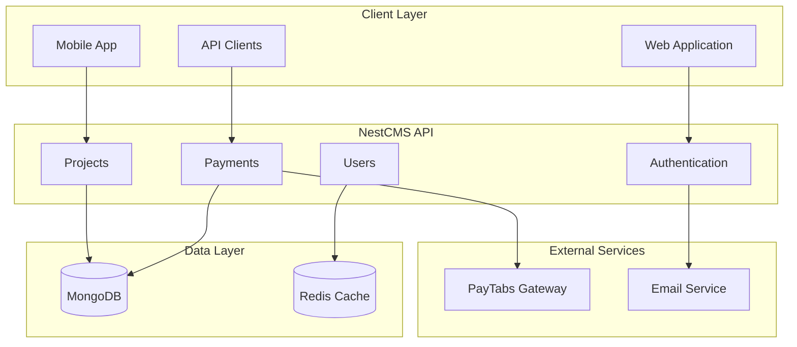

# 🏗️ NestCMS - Construction Company Management System

<p align="center">
  
  
</p>

<p align="center">
  
  
  
  
  
  
  
  
</p>

<p align="center">
  <strong>🏆 Enterprise-grade Construction Company Management System built with NestJS, TypeScript, and MongoDB</strong>
</p>

---

## 📋 Table of Contents

- [🎯 Project Overview](#-project-overview)
- [✨ Key Features](#-key-features)
- [🏛️ System Architecture](#️-system-architecture)
- [📊 Architecture Diagrams](#-architecture-diagrams)
- [🚀 Getting Started](#-getting-started)
- [🔧 Development](#-development)
- [🧪 Testing](#-testing)
- [🐳 Docker Deployment](#-docker-deployment)
- [📚 API Documentation](#-api-documentation)
- [🔐 Security](#-security)
- [💰 Payment Integration](#-payment-integration)
- [📈 Performance](#-performance)
- [🤝 Contributing](#-contributing)
- [📄 License](#-license)

---

## 🎯 **Project Overview**

**NestCMS** is a comprehensive, production-ready Construction Company Management System designed to streamline all aspects of construction business operations. Built with modern web technologies and enterprise-grade architecture, it provides a complete solution for managing projects, contracts, payments, schedules, and organizational workflows.

### 🏢 **Business Domain**
- **Industry**: Construction & Project Management
- **Target Users**: Construction companies, project managers, contractors, clients
- **Core Purpose**: End-to-end construction project lifecycle management
- **Scale**: Multi-organization, multi-project enterprise solution

### 🎯 **Key Business Value**
- **Operational Efficiency**: Streamlined project workflows and automated processes
- **Financial Control**: Integrated payment processing and earnings tracking
- **Quality Assurance**: Structured project steps and milestone management
- **Scalability**: Multi-organization support with role-based access control
- **Transparency**: Real-time project status and financial reporting

---

## ✨ **Key Features**

### 🏗️ **Project Management**
- **📋 Complete Project Lifecycle**: From initiation to completion with status tracking
- **🔄 Project Steps Management**: Granular step-by-step progression with dependencies
- **🎨 Design Management**: Project design document handling and versioning
- **👷 Worker Assignment**: Dynamic team allocation and role management
- **📊 Status Tracking**: Real-time project monitoring and progress reporting
- **📝 Project Notes**: Collaborative note-taking and communication tracking

### 👥 **User & Organization Management**
- **🔐 Multi-Role System**: Support for Clients, Employees, Contractors, Admins, and Owners
- **🏢 Organization Management**: Multi-organization support with hierarchical structures
- **🛡️ Permission System**: Granular role-based access control (RBAC)
- **🔑 Authentication**: JWT-based secure authentication with Passport strategies
- **👤 User Profiles**: Comprehensive user management with address and contact info

### 💰 **Financial Operations**
- **💳 Payment Processing**: Integrated PayTabs payment gateway with complete lifecycle management
- **📄 Contract Management**: Digital contract creation, signing, and management
- **📈 Earnings Tracking**: Project-based earnings and commission calculations with aggregation
- **💼 Offer Management**: Bid and proposal management system with approval workflows
- **🌍 Multi-Currency Support**: International payment processing capabilities
- **✅ Transaction Verification**: Secure payment verification and callback handling
- **💸 Commission System**: Automated commission calculations and distribution

### 📅 **Scheduling & Planning**
- **⏰ Project Scheduling**: Timeline and milestone management with dependencies
- **👷 Resource Planning**: Worker and equipment scheduling optimization
- **📆 Calendar Integration**: Schedule coordination and conflict resolution
- **🔄 Dynamic Rescheduling**: Adaptive scheduling based on project changes

### 📊 **Content & Documentation**
- **📝 Article System**: Knowledge base and documentation management
- **📋 Note Management**: Project notes and communication tracking
- **📁 Document Storage**: File and document management system
- **🔍 Search & Filter**: Advanced search capabilities across all content

### 📈 **Analytics & Reporting**
- **📊 Financial Reports**: Comprehensive earnings and expense reporting
- **📈 Project Analytics**: Performance metrics and trend analysis
- **💹 Commission Reports**: Detailed commission tracking and distribution reports
- **🎯 KPI Dashboard**: Key performance indicators and business metrics

---

## 🏛️ **System Architecture**

### **Technology Stack**
```
🎨 Frontend API: RESTful API with Swagger Documentation
🚀 Backend Framework: NestJS 10.4.4 with TypeScript 5.6.2
🗄️ Database: MongoDB 8.7.0 with Mongoose ODM
🔐 Authentication: JWT with Passport (Local & JWT strategies)
💳 Payment Gateway: PayTabs Integration with callback handling
⚡ Build System: SWC Compiler for fast builds and hot reload
🧪 Testing: Jest with unit and e2e testing suites
📚 Documentation: Swagger UI with dark theme and comprehensive endpoints
🐳 Containerization: Docker support with multi-stage builds
☁️ Cloud Ready: Kubernetes deployment configurations
```

### **Modular Architecture**
```
📦 Core Infrastructure Modules
├── 🔐 Authentication & Authorization (JWT, Passport, Guards)
├── 👤 Users & Organizations Management (Multi-role, RBAC)
├── 🛡️ Permissions & Security (Role-based access control)
└── 🌐 API Gateway (CORS, Middleware, Interceptors)

📦 Business Logic Modules  
├── 🏗️ Projects & Project Steps (Lifecycle management)
├── 📋 Contracts & Offers (Legal agreements, proposals)
├── 💳 Payments & Earnings (Financial transactions, tracking)
├── 📅 Schedules & Planning (Resource allocation, timelines)
└── 🏢 Organizations (Multi-tenant support)

📦 Supporting Modules
├── 📝 Articles & Notes (Content management, documentation)
├── 💸 Commission & Salary (Financial calculations, distribution)
├── 🎨 Designs & Documents (File management, versioning)
└── 📊 Analytics & Reporting (Business intelligence, KPIs)
```

### **Database Schema Overview**
- **👤 Users**: Multi-role user system with inheritance (User → Employee/Client/Admin → Owner)
- **🏢 Organizations**: Multi-tenant organizational structures with ownership
- **🏗️ Projects**: Core project entities with comprehensive relationships
- **📄 Contracts**: Legal agreements with payment and project linkage
- **💳 Payments**: Financial transactions with PayTabs integration
- **📅 Schedules**: Time-based project planning and resource allocation
- **📈 Earnings**: Aggregated financial calculations with multi-currency support
- **💸 Commissions**: Employee compensation tracking and distribution

---

## 📊 **Architecture Diagrams**

Comprehensive system architecture diagrams are available in the [Architecture Documentation](./docs/architecture-diagrams.md):

### 🏗️ **Available Diagrams**
1. **System Architecture Overview** - High-level system components and interactions
2. **Database Entity Relationship Diagram** - Complete data model with relationships
3. **User Role Hierarchy** - Role-based access control structure
4. **Project Lifecycle Workflow** - End-to-end project management process
5. **Payment Processing Flow** - Financial transaction handling
6. **Module Dependencies** - Inter-module relationships and dependencies
7. **API Endpoint Structure** - RESTful API organization
8. **Security Architecture** - Authentication and authorization flow

### 🔍 **Quick Architecture Preview**



---

## 🚀 **Getting Started**

### **Prerequisites**
- **Node.js** 18+ (LTS recommended)
- **MongoDB** 4.4+ (Local installation or MongoDB Atlas)
- **npm** or **yarn** package manager
- **Docker** (optional, for containerized deployment)
- **PayTabs Account** (for payment processing)

### **Environment Setup**

1. **Clone the repository**
```bash
git clone https://github.com/abdoElHodaky/Nestcms.git
cd Nestcms
```

2. **Install dependencies**
```bash
# Using npm
npm install

# Using yarn
yarn install
```

3. **Environment Configuration**
```bash
# Copy environment template
cp .env.example .env

# Configure your environment variables
nano .env
```

**Required Environment Variables:**
```env
# Database Configuration
MONGO_URI=mongodb://localhost:27017/nestcms
REDIS_URL=redis://localhost:6379

# JWT Configuration
JWT_SECRET=your-super-secret-jwt-key
JWT_EXPIRES_IN=24h

# PayTabs Configuration
PAYTABS_PROFILE_ID=your-paytabs-profile-id
PAYTABS_SERVER_KEY=your-paytabs-server-key
PAYTABS_REGION=your-paytabs-region

# Application Configuration
PORT=3000
NODE_ENV=development

# Email Configuration (Optional)
SMTP_HOST=smtp.gmail.com
SMTP_PORT=587
SMTP_USER=your-email@gmail.com
SMTP_PASS=your-email-password
```

4. **Database Setup**
```bash
# Start MongoDB (if running locally)
mongod

# The application will automatically create collections on first run
```

---

## 🔧 **Development**

### **Development Commands**
```bash
# Start development server with hot reload
npm run start:dev

# Build the application
npm run build

# Run in production mode
npm run start:prod

# Format code with Prettier
npm run format

# Lint code with TSLint
npm run lint

# Start with debugging
npm run start:debug
```

### **Development Workflow**
1. **Code Structure**: Follow NestJS module-based architecture
2. **Type Safety**: Leverage TypeScript for robust type checking
3. **API First**: Design APIs using Swagger decorators
4. **Database First**: Define Mongoose schemas with proper relationships
5. **Security First**: Implement proper authentication and authorization

### **Code Quality Standards**
- **TypeScript**: Strict mode enabled with comprehensive type checking
- **ESLint/TSLint**: Enforced coding standards and best practices
- **Prettier**: Consistent code formatting across the project
- **Husky**: Pre-commit hooks for code quality assurance
- **Conventional Commits**: Standardized commit message format

---

## 🧪 **Testing**

### **Testing Strategy**
```bash
# Run unit tests
npm run test

# Run tests in watch mode
npm run test:watch

# Run tests with coverage report
npm run test:cov

# Run e2e tests
npm run test:e2e

# Debug tests
npm run test:debug
```

### **Testing Structure**
- **Unit Tests**: Individual component and service testing
- **Integration Tests**: Module interaction testing
- **E2E Tests**: Complete workflow testing
- **Performance Tests**: Load and stress testing
- **Security Tests**: Authentication and authorization testing

### **Coverage Goals**
- **Unit Test Coverage**: > 80%
- **Integration Test Coverage**: > 70%
- **E2E Test Coverage**: > 60%
- **Critical Path Coverage**: 100%

---

## 🐳 **Docker Deployment**

### **Docker Configuration**
```bash
# Build Docker image
docker build -t nestcms:latest .

# Run with Docker Compose
docker-compose up -d

# Scale services
docker-compose up -d --scale nestcms=3
```

### **Docker Compose Services**
```yaml
version: '3.8'
services:
  nestcms:
    build: .
    ports:
      - "3000:3000"
    environment:
      - MONGO_URI=mongodb://mongo:27017/nestcms
    depends_on:
      - mongo
      - redis
  
  mongo:
    image: mongo:5.0
    ports:
      - "27017:27017"
    volumes:
      - mongo_data:/data/db
  
  redis:
    image: redis:7-alpine
    ports:
      - "6379:6379"
```

### **Kubernetes Deployment**
```bash
# Deploy to Kubernetes
kubectl apply -f k8s/

# Check deployment status
kubectl get pods -l app=nestcms

# Scale deployment
kubectl scale deployment nestcms --replicas=5
```

---

## 📚 **API Documentation**

### **Swagger Documentation**
- **URL**: `http://localhost:3000/docs`
- **Theme**: Dark theme with custom styling
- **Authentication**: Bearer token support
- **Interactive**: Full API testing capabilities

### **API Endpoints Overview**

#### 🔐 **Authentication Endpoints**
```
POST   /auth/login          - User login
POST   /auth/register       - User registration  
POST   /auth/refresh        - Token refresh
POST   /auth/logout         - User logout
```

#### 👤 **User Management**
```
GET    /users               - List users
POST   /users               - Create user
GET    /users/:id           - Get user details
PUT    /users/:id           - Update user
DELETE /users/:id           - Delete user
```

#### 🏗️ **Project Management**
```
GET    /projects            - List projects
POST   /projects            - Create project
GET    /projects/:id        - Get project details
PUT    /projects/:id        - Update project
DELETE /projects/:id        - Delete project

# Project Sub-resources
GET    /projects/:id/steps     - Project steps
POST   /projects/:id/steps     - Add project step
GET    /projects/:id/designs   - Project designs
POST   /projects/:id/designs   - Add design
GET    /projects/:id/workers   - Project workers
POST   /projects/:id/workers   - Assign worker
GET    /projects/:id/notes     - Project notes
POST   /projects/:id/notes     - Add note
```

#### 💳 **Payment Processing**
```
POST   /payments/create     - Create payment
POST   /payments/verify     - Verify payment
POST   /payments/callback   - Payment callback
GET    /payments/:id/status - Payment status
GET    /payments            - List payments
```

#### 📄 **Contract Management**
```
GET    /contracts           - List contracts
POST   /contracts           - Create contract
GET    /contracts/:id       - Get contract
PUT    /contracts/:id       - Update contract
DELETE /contracts/:id       - Delete contract
```

### **API Response Format**
```json
{
  "success": true,
  "data": {
    // Response data
  },
  "message": "Operation successful",
  "timestamp": "2024-01-01T00:00:00.000Z",
  "path": "/api/endpoint"
}
```

---

## 🔐 **Security**

### **Authentication & Authorization**
- **JWT Tokens**: Secure token-based authentication
- **Passport Strategies**: Local and JWT authentication strategies
- **Role-Based Access Control**: Granular permission system
- **Multi-Factor Authentication**: Optional 2FA support
- **Session Management**: Secure session handling

### **Security Features**
- **Password Hashing**: bcrypt with salt rounds
- **Input Validation**: Comprehensive request validation
- **SQL Injection Protection**: MongoDB injection prevention
- **XSS Protection**: Cross-site scripting prevention
- **CORS Configuration**: Configurable cross-origin requests
- **Rate Limiting**: API rate limiting and throttling
- **Helmet Integration**: Security headers middleware

### **Security Best Practices**
- **Environment Variables**: Sensitive data in environment variables
- **Secrets Management**: Secure secret storage and rotation
- **Audit Logging**: Comprehensive security event logging
- **Regular Updates**: Dependency vulnerability scanning
- **Security Headers**: Comprehensive security header implementation

---

## 💰 **Payment Integration**

### **PayTabs Integration**
- **Supported Methods**: Credit cards, digital wallets, bank transfers
- **Multi-Currency**: Support for multiple currencies
- **Secure Processing**: PCI DSS compliant payment processing
- **Webhook Support**: Real-time payment status updates
- **Refund Management**: Automated refund processing

### **Payment Workflow**
1. **Payment Initiation**: Client initiates payment request
2. **Payment Page**: Redirect to secure PayTabs payment page
3. **Payment Processing**: PayTabs processes the payment
4. **Callback Handling**: Secure callback verification
5. **Status Update**: Update payment and contract status
6. **Notification**: Notify relevant parties of payment status

### **Payment Security**
- **Encryption**: End-to-end payment data encryption
- **Tokenization**: Secure payment token management
- **Fraud Detection**: Built-in fraud prevention
- **Compliance**: PCI DSS and regulatory compliance

---

## 📈 **Performance**

### **Performance Optimizations**
- **Database Indexing**: Optimized MongoDB indexes
- **Caching Strategy**: Redis caching for frequently accessed data
- **Connection Pooling**: Efficient database connection management
- **Lazy Loading**: Optimized data loading strategies
- **Compression**: Response compression for reduced bandwidth

### **Monitoring & Metrics**
- **Health Checks**: Comprehensive application health monitoring
- **Performance Metrics**: Response time and throughput tracking
- **Error Tracking**: Comprehensive error logging and tracking
- **Resource Monitoring**: CPU, memory, and database monitoring

### **Scalability**
- **Horizontal Scaling**: Support for multiple application instances
- **Load Balancing**: Efficient request distribution
- **Database Sharding**: MongoDB sharding support
- **Microservices Ready**: Modular architecture for service extraction

---

## 🤝 **Contributing**

### **Development Guidelines**
1. **Fork the repository** and create a feature branch
2. **Follow coding standards** and maintain test coverage
3. **Write comprehensive tests** for new features
4. **Update documentation** for API changes
5. **Submit pull requests** with detailed descriptions

### **Code Contribution Process**
```bash
# Fork and clone the repository
git clone https://github.com/your-username/Nestcms.git

# Create a feature branch
git checkout -b feature/your-feature-name

# Make your changes and commit
git commit -m "feat: add your feature description"

# Push to your fork and submit a pull request
git push origin feature/your-feature-name
```

### **Contribution Areas**
- **Feature Development**: New business features and capabilities
- **Performance Optimization**: Database and application performance
- **Security Enhancements**: Security feature improvements
- **Documentation**: Technical and user documentation
- **Testing**: Test coverage and quality improvements
- **DevOps**: Deployment and infrastructure improvements

---

## 📄 **License**

This project is licensed under the **UNLICENSED** license. See the [LICENSE](LICENSE) file for details.

---

## 📞 **Support & Contact**

- **Author**: Abdoelhodaky
- **Email**: [Contact Email]
- **GitHub**: [https://github.com/abdoElHodaky](https://github.com/abdoElHodaky)
- **Issues**: [GitHub Issues](https://github.com/abdoElHodaky/Nestcms/issues)
- **Discussions**: [GitHub Discussions](https://github.com/abdoElHodaky/Nestcms/discussions)

---

## 🙏 **Acknowledgments**

- **NestJS Team** for the excellent framework
- **MongoDB Team** for the robust database solution
- **PayTabs** for payment processing capabilities
- **Open Source Community** for the amazing tools and libraries

---

<p align="center">
  <strong>🏗️ Built with ❤️ for the Construction Industry</strong>
</p>

<p align="center">
  
  
  
</p>

