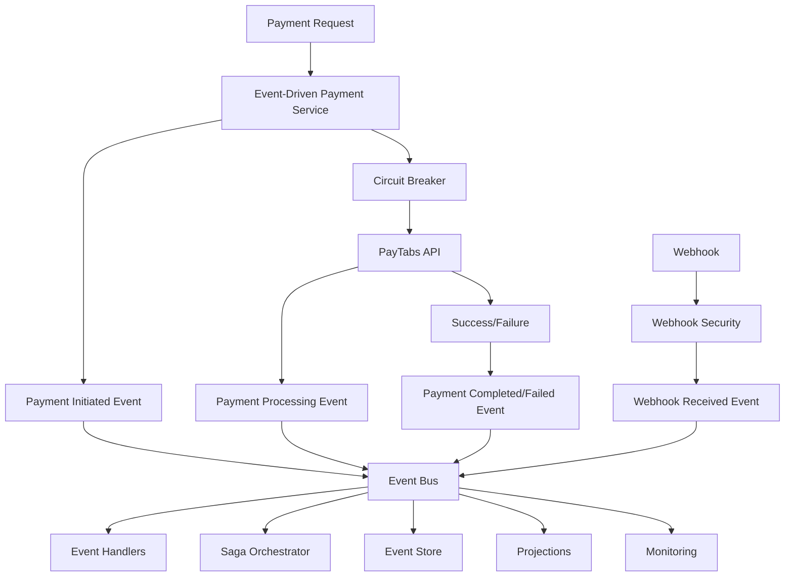
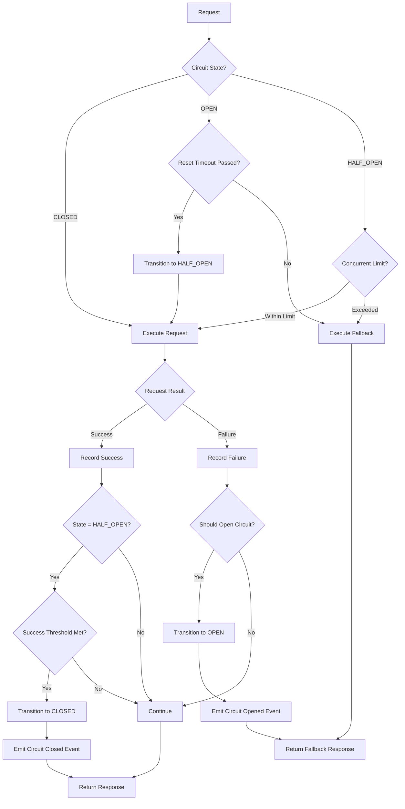
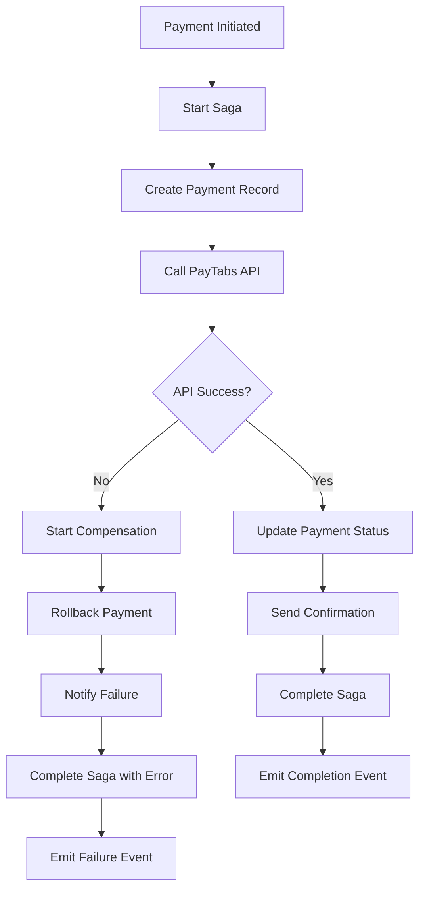

# 🎯 **EVENT-DRIVEN PAYMENT ARCHITECTURE**

## 🚀 **COMPREHENSIVE EVENT-DRIVEN PAYMENT SYSTEM WITH CIRCUIT BREAKER PATTERNS**

> **Status: ✅ FULLY IMPLEMENTED** - Complete event-driven payment architecture with circuit breaker resilience, saga patterns, and comprehensive monitoring!

---

## 📋 **TABLE OF CONTENTS**

1. [Overview](#overview)
2. [Event-Driven Architecture](#event-driven-architecture)
3. [Circuit Breaker Patterns](#circuit-breaker-patterns)
4. [Payment Event System](#payment-event-system)
5. [Saga Patterns](#saga-patterns)
6. [API Endpoints](#api-endpoints)
7. [Configuration](#configuration)
8. [Monitoring & Metrics](#monitoring--metrics)
9. [Troubleshooting](#troubleshooting)

---

## 🎯 **OVERVIEW**

This implementation provides a **production-ready event-driven payment architecture** with comprehensive circuit breaker patterns for external service resilience. The system includes:

### **🏗️ Core Architecture Components**

- **Event-Driven Payment Service**: Complete payment lifecycle with event sourcing
- **Advanced Circuit Breaker**: Multi-layer resilience with comprehensive metrics
- **Saga Pattern Implementation**: Complex business process orchestration
- **Event Bus System**: Asynchronous event processing and distribution
- **Performance Monitoring**: Real-time metrics and health monitoring
- **Webhook Security**: Enhanced security with signature verification

### **🛡️ Resilience Features**

- **Circuit Breaker Protection**: Automatic service protection and recovery
- **Fallback Mechanisms**: Graceful degradation with fallback responses
- **Retry Patterns**: Intelligent retry with exponential backoff
- **Event Sourcing**: Complete audit trail and event replay capability
- **Saga Compensation**: Automatic rollback for failed transactions

---

## 🎯 **EVENT-DRIVEN ARCHITECTURE**

### **📊 Event System Overview**

The event-driven architecture provides comprehensive event tracking for the entire payment lifecycle:

#### **🔄 Payment Event Types**

```typescript
enum PaymentEventType {
  // Payment Lifecycle Events
  PAYMENT_INITIATED = 'payment.initiated',
  PAYMENT_PROCESSING = 'payment.processing',
  PAYMENT_COMPLETED = 'payment.completed',
  PAYMENT_FAILED = 'payment.failed',
  PAYMENT_CANCELLED = 'payment.cancelled',
  PAYMENT_REFUNDED = 'payment.refunded',
  
  // Webhook Events
  WEBHOOK_RECEIVED = 'webhook.received',
  WEBHOOK_PROCESSED = 'webhook.processed',
  WEBHOOK_FAILED = 'webhook.failed',
  
  // Circuit Breaker Events
  CIRCUIT_BREAKER_OPENED = 'circuit_breaker.opened',
  CIRCUIT_BREAKER_CLOSED = 'circuit_breaker.closed',
  CIRCUIT_BREAKER_HALF_OPEN = 'circuit_breaker.half_open',
  
  // Business Events
  CONTRACT_PAYMENT_DUE = 'contract.payment_due',
  EARNINGS_CALCULATED = 'earnings.calculated',
  
  // Audit Events
  PAYMENT_AUDIT_LOG = 'payment.audit_log',
  SECURITY_EVENT = 'security.event',
  PERFORMANCE_METRIC = 'performance.metric',
}
```

#### **📋 Event Structure**

Each event follows a standardized structure with comprehensive metadata:

```typescript
interface BasePaymentEvent {
  id: string;                    // Unique event identifier
  type: PaymentEventType;        // Event type
  timestamp: Date;               // Event timestamp
  version: string;               // Event schema version
  priority: PaymentEventPriority; // Event priority (LOW, MEDIUM, HIGH, CRITICAL)
  status: PaymentEventStatus;    // Event processing status
  correlationId: string;         // Request correlation ID
  causationId?: string;          // Causing event ID
  aggregateId: string;           // Aggregate root ID
  aggregateType: string;         // Aggregate type
  metadata: {
    source: string;              // Event source service
    userId?: string;             // User identifier
    sessionId?: string;          // Session identifier
    ipAddress?: string;          // Client IP address
    userAgent?: string;          // Client user agent
    traceId?: string;            // Distributed tracing ID
    spanId?: string;             // Tracing span ID
  };
}
```

### **🔄 Event Flow Architecture**



---

## ⚡ **CIRCUIT BREAKER PATTERNS**

### **🛡️ Advanced Circuit Breaker Implementation**

The event-driven circuit breaker provides comprehensive protection for external services:

#### **📊 Circuit Breaker States**

```typescript
enum CircuitBreakerState {
  CLOSED = 'CLOSED',        // Normal operation
  OPEN = 'OPEN',           // Service protection active
  HALF_OPEN = 'HALF_OPEN', // Testing service recovery
}
```

#### **⚙️ Configuration Options**

```typescript
interface EventDrivenCircuitBreakerConfig {
  name: string;                      // Circuit breaker name
  errorThreshold: number;            // Error rate % to trigger open (default: 50%)
  timeout: number;                   // Request timeout in ms (default: 30000)
  resetTimeout: number;              // Time before retry in ms (default: 60000)
  minimumRequests: number;           // Min requests before evaluation (default: 10)
  maxConcurrentRequests: number;     // Max concurrent in half-open (default: 5)
  volumeThreshold: number;           // Min volume for evaluation (default: 20)
  slowCallThreshold: number;         // Slow call threshold in ms (default: 10000)
  slowCallRateThreshold: number;     // Slow call rate % (default: 50%)
  enableEventEmission: boolean;      // Enable event emission (default: true)
  enableMetrics: boolean;            // Enable metrics collection (default: true)
}
```

#### **📈 Comprehensive Metrics**

```typescript
interface CircuitBreakerMetrics {
  totalRequests: number;             // Total requests processed
  successfulRequests: number;        // Successful requests
  failedRequests: number;            // Failed requests
  timeouts: number;                  // Timeout occurrences
  slowCalls: number;                 // Slow calls detected
  rejectedRequests: number;          // Rejected by circuit breaker
  averageResponseTime: number;       // Average response time
  p95ResponseTime: number;           // 95th percentile response time
  p99ResponseTime: number;           // 99th percentile response time
  errorRate: number;                 // Current error rate %
  successRate: number;               // Current success rate %
  slowCallRate: number;              // Current slow call rate %
  uptime: number;                    // Service uptime %
  throughput: number;                // Requests per second
}
```

### **🔄 Circuit Breaker Operation Flow**



---

## 💳 **PAYMENT EVENT SYSTEM**

### **🎯 Payment Lifecycle Events**

#### **1. Payment Initiated Event**

```typescript
interface PaymentInitiatedEvent extends BasePaymentEvent {
  type: PaymentEventType.PAYMENT_INITIATED;
  data: {
    paymentId: string;
    contractId: string;
    amount: number;
    currency: string;
    description: string;
    clientInfo: ClientInfo;
    paymentMethod: string;
    redirectUrl?: string;
    callbackUrl?: string;
  };
}
```

#### **2. Payment Processing Event**

```typescript
interface PaymentProcessingEvent extends BasePaymentEvent {
  type: PaymentEventType.PAYMENT_PROCESSING;
  data: {
    paymentId: string;
    transactionRef: string;
    gatewayProvider: string;
    processingStartTime: Date;
    estimatedCompletionTime?: Date;
  };
}
```

#### **3. Payment Completed Event**

```typescript
interface PaymentCompletedEvent extends BasePaymentEvent {
  type: PaymentEventType.PAYMENT_COMPLETED;
  data: {
    paymentId: string;
    transactionRef: string;
    amount: number;
    currency: string;
    gatewayResponse: any;
    completedAt: Date;
    processingDuration: number;
  };
}
```

### **🔐 Webhook Events**

#### **Webhook Received Event**

```typescript
interface WebhookReceivedEvent extends BasePaymentEvent {
  type: PaymentEventType.WEBHOOK_RECEIVED;
  data: {
    webhookId: string;
    paymentId?: string;
    transactionRef?: string;
    provider: string;
    payload: any;
    signature: string;
    timestamp: string;
    ipAddress: string;
    headers: Record<string, string>;
  };
}
```

### **⚡ Circuit Breaker Events**

#### **Circuit Breaker State Change Event**

```typescript
interface CircuitBreakerEvent extends BasePaymentEvent {
  type: PaymentEventType.CIRCUIT_BREAKER_OPENED | 
        PaymentEventType.CIRCUIT_BREAKER_CLOSED | 
        PaymentEventType.CIRCUIT_BREAKER_HALF_OPEN;
  data: {
    serviceName: string;
    state: 'OPEN' | 'CLOSED' | 'HALF_OPEN';
    errorRate: number;
    requestCount: number;
    failureCount: number;
    lastFailureTime?: Date;
    nextRetryTime?: Date;
    configuration: CircuitBreakerConfig;
  };
}
```

---

## 🔄 **SAGA PATTERNS**

### **🎯 Payment Processing Saga**

The saga pattern orchestrates complex business processes across multiple services:

```typescript
class PaymentProcessingSaga {
  public isCompleted = false;
  private steps: string[] = [];

  constructor(
    public readonly sagaId: string,
    public readonly correlationId: string,
  ) {}

  async handle(event: PaymentEvent): Promise<PaymentEvent[]> {
    this.steps.push(event.type);
    
    switch (event.type) {
      case PaymentEventType.PAYMENT_INITIATED:
        return await this.handlePaymentInitiated(event);
      case PaymentEventType.PAYMENT_COMPLETED:
        return await this.handlePaymentCompleted(event);
      case PaymentEventType.PAYMENT_FAILED:
        return await this.handlePaymentFailed(event);
      default:
        return [];
    }
  }

  async compensate(): Promise<PaymentEvent[]> {
    // Implement compensation logic for failed transactions
    const compensationEvents: PaymentEvent[] = [];
    
    // Reverse the steps in LIFO order
    for (const step of this.steps.reverse()) {
      const compensationEvent = await this.createCompensationEvent(step);
      if (compensationEvent) {
        compensationEvents.push(compensationEvent);
      }
    }
    
    return compensationEvents;
  }

  async complete(): Promise<void> {
    this.isCompleted = true;
  }
}
```

### **🔄 Saga Orchestration Flow**


