# 🏗️ NestCMS Architecture Diagrams

## 1. System Architecture Overview


## 2. Database Entity Relationship Diagram


## 3. User Role Hierarchy

```mermaid
graph TD
    User[👤 User<br/>Base User Entity]
    
    User --> Client[👥 Client<br/>External Customer]
    User --> Employee[👷 Employee<br/>Company Worker]
    User --> Admin[👨‍💼 Admin<br/>System Administrator]
    
    Employee --> Owner[👑 Owner<br/>Company Owner]
    
    Client --> ClientFeatures[🔹 Client Features<br/>• View Projects<br/>• Make Payments<br/>• Sign Contracts<br/>• Submit Offers]
    
    Employee --> EmployeeFeatures[🔹 Employee Features<br/>• Manage Projects<br/>• Create Contracts<br/>• Process Payments<br/>• Earn Commissions<br/>• Receive Salaries]
    
    Admin --> AdminFeatures[🔹 Admin Features<br/>• User Management<br/>• System Configuration<br/>• Permission Management<br/>• Reports & Analytics]
    
    Owner --> OwnerFeatures[🔹 Owner Features<br/>• Organization Management<br/>• Financial Oversight<br/>• Strategic Planning<br/>• All Admin Features]
    
    style User fill:#e1f5fe
    style Client fill:#f3e5f5
    style Employee fill:#e8f5e8
    style Admin fill:#fff3e0
    style Owner fill:#fce4ec
```



## 4. Project Lifecycle Workflow

```mermaid
graph TD
    Start([Project Initiation]) --> Offer[📋 Create Offer]
    Offer --> OfferReview{Client Review}
    OfferReview -->|Accepted| Contract[📄 Generate Contract]
    OfferReview -->|Rejected| OfferRevision[📝 Revise Offer]
    OfferRevision --> Offer
    
    Contract --> ContractSigning[✍️ Contract Signing]
    ContractSigning --> ProjectCreation[🏗️ Create Project]
    
    ProjectCreation --> ProjectPlanning[📅 Project Planning]
    ProjectPlanning --> ResourceAllocation[👷 Assign Workers]
    ResourceAllocation --> ScheduleCreation[⏰ Create Schedule]
    
    ScheduleCreation --> ProjectExecution[🔨 Project Execution]
    
    ProjectExecution --> StepManagement[📋 Manage Project Steps]
    StepManagement --> StepComplete{Step Complete?}
    StepComplete -->|No| StepWork[Continue Work]
    StepWork --> StepManagement
    StepComplete -->|Yes| NextStep{More Steps?}
    NextStep -->|Yes| StepManagement
    NextStep -->|No| ProjectReview[🔍 Project Review]
    
    ProjectReview --> QualityCheck{Quality OK?}
    QualityCheck -->|No| Rework[🔧 Rework Required]
    Rework --> StepManagement
    QualityCheck -->|Yes| ProjectCompletion[✅ Project Completion]
    
    ProjectCompletion --> FinalPayment[💰 Final Payment]
    FinalPayment --> EarningsCalculation[📊 Calculate Earnings]
    EarningsCalculation --> CommissionDistribution[💸 Distribute Commissions]
    CommissionDistribution --> ProjectClosure[🏁 Project Closure]
    
    %% Payment Flow (Parallel Process)
    Contract --> InitialPayment[💳 Initial Payment]
    InitialPayment --> PaymentVerification[✅ Payment Verification]
    PaymentVerification --> MilestonePayments[💰 Milestone Payments]
    MilestonePayments --> ProjectExecution
    
    style Start fill:#e8f5e8
    style ProjectClosure fill:#ffcdd2
    style Contract fill:#e1f5fe
    style ProjectExecution fill:#fff3e0
```



## 5. Payment Processing Flow


## 6. Module Dependencies


## 7. API Endpoint Structure

```mermaid
graph TD
    API[🌐 NestCMS API]
    
    API --> AUTH_EP[🔐 /auth<br/>Authentication Endpoints]
    API --> USERS_EP[👤 /users<br/>User Management]
    API --> ORGS_EP[🏢 /organizations<br/>Organization Management]
    API --> PROJ_EP[🏗️ /projects<br/>Project Management]
    API --> CONT_EP[📄 /contracts<br/>Contract Management]
    API --> PAY_EP[💳 /payments<br/>Payment Processing]
    API --> SCHED_EP[📅 /schedules<br/>Schedule Management]
    API --> EARN_EP[📊 /earnings<br/>Earnings & Reports]
    API --> ART_EP[📝 /articles<br/>Content Management]
    API --> NOTE_EP[📋 /notes<br/>Notes Management]
    API --> OFFER_EP[💼 /offers<br/>Offer Management]
    API --> PERM_EP[🛡️ /permissions<br/>Permission Management]
    
    AUTH_EP --> LOGIN[POST /login]
    AUTH_EP --> REGISTER[POST /register]
    AUTH_EP --> REFRESH[POST /refresh]
    
    PROJ_EP --> PROJ_CRUD[CRUD Operations]
    PROJ_EP --> PROJ_STEPS[/projects/:id/steps]
    PROJ_EP --> PROJ_DESIGNS[/projects/:id/designs]
    PROJ_EP --> PROJ_WORKERS[/projects/:id/workers]
    PROJ_EP --> PROJ_NOTES[/projects/:id/notes]
    
    PAY_EP --> PAY_CREATE[POST /create]
    PAY_EP --> PAY_VERIFY[POST /verify]
    PAY_EP --> PAY_CALLBACK[POST /callback]
    PAY_EP --> PAY_STATUS[GET /:id/status]
    
    style API fill:#e1f5fe
    style AUTH_EP fill:#ffcdd2
    style PROJ_EP fill:#e8f5e8
    style PAY_EP fill:#fff3e0
```

## 8. Security Architecture


---

*These diagrams provide a comprehensive view of the NestCMS architecture, from high-level system overview to detailed component interactions. They serve as living documentation that should be updated as the system evolves.*

