# 🎨 Beautiful NestCMS Architecture Diagrams

This document contains stunning, comprehensive architecture diagrams for the NestCMS Construction Company Management System, redesigned with enhanced visual appeal and detailed information.

## 1. 🌟 Spectacular System Architecture Overview

```mermaid
graph TB
    subgraph "🌐 Client Layer"
        WEB["🖥️ Web Application<br/>━━━━━━━━━━━━━━━<br/>⚛️ React/Angular/Vue<br/>📱 Responsive Design<br/>🎨 Modern UI/UX"]
        MOBILE["📱 Mobile App<br/>━━━━━━━━━━━━━━━<br/>📲 React Native/Flutter<br/>🔄 Offline Sync<br/>📍 Location Services"]
        API_CLIENT["🔌 API Clients<br/>━━━━━━━━━━━━━━━<br/>🤖 Third-party Integrations<br/>📊 Business Intelligence<br/>🔗 External Systems"]
    end
    
    subgraph "🚪 API Gateway & Security Layer"
        SWAGGER["📚 Swagger UI<br/>━━━━━━━━━━━━━━━<br/>📖 Interactive API Docs<br/>🧪 API Testing<br/>🎨 Dark Theme"]
        CORS["🌍 CORS Middleware<br/>━━━━━━━━━━━━━━━<br/>🔐 Cross-Origin Security<br/>🌐 Domain Whitelisting<br/>🛡️ Request Filtering"]
        RATE_LIMIT["⚡ Rate Limiter<br/>━━━━━━━━━━━━━━━<br/>🚦 Request Throttling<br/>📊 Usage Analytics<br/>🛡️ DDoS Protection"]
        AUTH_GUARD["🛡️ Auth Guard<br/>━━━━━━━━━━━━━━━<br/>🎫 JWT Validation<br/>⏰ Token Expiry<br/>🔐 Session Management"]
        PERM_GUARD["🔐 Permission Guard<br/>━━━━━━━━━━━━━━━<br/>👥 RBAC Authorization<br/>🎯 Resource Access<br/>📊 Audit Logging"]
    end
    
    subgraph "🏗️ Core Business Layer"
        subgraph "👥 User Management"
            AUTH["🔑 Authentication<br/>━━━━━━━━━━━━━━━<br/>🎫 JWT + Passport<br/>🔐 Multi-factor Auth<br/>📧 Email Verification"]
            USERS["👤 Users Service<br/>━━━━━━━━━━━━━━━<br/>👥 Multi-role System<br/>📊 Profile Management<br/>🏢 Organization Links"]
            ORGS["🏢 Organizations<br/>━━━━━━━━━━━━━━━<br/>🏢 Multi-tenant Support<br/>👑 Ownership Model<br/>📊 Hierarchy Management"]
            PERMISSIONS["🛡️ Permissions<br/>━━━━━━━━━━━━━━━<br/>🎯 Role-based Access<br/>🔐 Resource Control<br/>📊 Permission Matrix"]
        end
        
        subgraph "💼 Project Management"
            PROJECTS["🏗️ Projects Service<br/>━━━━━━━━━━━━━━━<br/>📋 Lifecycle Management<br/>👷 Team Coordination<br/>📊 Progress Tracking"]
            SCHEDULES["📅 Schedules<br/>━━━━━━━━━━━━━━━<br/>⏰ Timeline Planning<br/>🎯 Milestone Tracking<br/>📊 Resource Allocation"]
            NOTES["📝 Notes<br/>━━━━━━━━━━━━━━━<br/>💬 Communication Hub<br/>📋 Documentation<br/>🔄 Real-time Collaboration"]
            DESIGNS["🎨 Designs<br/>━━━━━━━━━━━━━━━<br/>📁 Document Management<br/>🖼️ File Versioning<br/>☁️ Cloud Storage"]
        end
        
        subgraph "💰 Financial Operations"
            CONTRACTS["📄 Contracts<br/>━━━━━━━━━━━━━━━<br/>⚖️ Legal Agreements<br/>✍️ Digital Signatures<br/>📊 Template Management"]
            PAYMENTS["💳 Payments<br/>━━━━━━━━━━━━━━━<br/>💰 Transaction Processing<br/>🔐 PayTabs Integration<br/>📊 Multi-currency Support"]
            EARNINGS["📊 Earnings<br/>━━━━━━━━━━━━━━━<br/>💰 Financial Analytics<br/>📈 Revenue Tracking<br/>📊 Profit Margins"]
            COMMISSION["💸 Commission<br/>━━━━━━━━━━━━━━━<br/>👥 Compensation System<br/>📈 Performance Bonuses<br/>💰 Automated Distribution"]
            OFFERS["💼 Offers<br/>━━━━━━━━━━━━━━━<br/>📋 Proposal Management<br/>💰 Pricing Strategy<br/>🤝 Client Negotiations"]
        end
        
        subgraph "📚 Content Management"
            ARTICLES["📖 Articles<br/>━━━━━━━━━━━━━━━<br/>📚 Knowledge Base<br/>✍️ Content Creation<br/>🔍 Search & Indexing"]
            REPORTS["📈 Reports<br/>━━━━━━━━━━━━━━━<br/>📊 Business Intelligence<br/>📈 Data Visualization<br/>📋 Custom Dashboards"]
            ANALYTICS["📊 Analytics<br/>━━━━━━━━━━━━━━━<br/>📈 Performance Metrics<br/>🎯 KPI Tracking<br/>📊 Predictive Analysis"]
        end
    end
    
    subgraph "🌍 External Services"
        PAYTABS["💳 PayTabs Gateway<br/>━━━━━━━━━━━━━━━<br/>💰 Payment Processing<br/>🔐 Secure Transactions<br/>🌍 Global Coverage"]
        EMAIL["📧 Email Service<br/>━━━━━━━━━━━━━━━<br/>📨 SMTP/SendGrid<br/>📧 Template Engine<br/>📊 Delivery Analytics"]
        FILE_STORAGE["📁 File Storage<br/>━━━━━━━━━━━━━━━<br/>☁️ AWS S3/CloudFlare<br/>🔐 Secure Upload<br/>📊 CDN Distribution"]
        NOTIFICATIONS["🔔 Push Notifications<br/>━━━━━━━━━━━━━━━<br/>📱 Firebase/OneSignal<br/>⚡ Real-time Alerts<br/>🎯 Targeted Messaging"]
    end
    
    subgraph "💾 Data & Cache Layer"
        MONGODB[("🍃 MongoDB<br/>━━━━━━━━━━━━━━━<br/>📊 Primary Database<br/>🗄️ Document Store<br/>🔄 Replica Sets")]
        REDIS[("⚡ Redis<br/>━━━━━━━━━━━━━━━<br/>🚀 Cache & Sessions<br/>💾 In-Memory Store<br/>📊 Real-time Data")]
        BACKUP[("💾 Backup Storage<br/>━━━━━━━━━━━━━━━<br/>🔄 Automated Backups<br/>⏰ Point-in-time Recovery<br/>🔐 Encrypted Storage")]
    end
    
    %% 🔗 Client connections
    WEB --> SWAGGER
    WEB --> RATE_LIMIT
    MOBILE --> AUTH_GUARD
    API_CLIENT --> CORS
    
    %% 🛡️ Security flow
    SWAGGER --> AUTH_GUARD
    RATE_LIMIT --> AUTH_GUARD
    CORS --> AUTH_GUARD
    AUTH_GUARD --> PERM_GUARD
    
    %% 🔐 Authentication flow
    AUTH_GUARD --> AUTH
    PERM_GUARD --> PERMISSIONS
    AUTH --> USERS
    USERS --> ORGS
    
    %% 💼 Business logic connections
    PROJECTS --> CONTRACTS
    CONTRACTS --> PAYMENTS
    PAYMENTS --> PAYTABS
    PAYMENTS --> EARNINGS
    EARNINGS --> COMMISSION
    PROJECTS --> SCHEDULES
    PROJECTS --> NOTES
    PROJECTS --> DESIGNS
    CONTRACTS --> OFFERS
    
    %% 📚 Content connections
    USERS --> ARTICLES
    PROJECTS --> REPORTS
    EARNINGS --> ANALYTICS
    
    %% 🌍 External service connections
    AUTH --> EMAIL
    PAYMENTS --> PAYTABS
    DESIGNS --> FILE_STORAGE
    USERS --> NOTIFICATIONS
    
    %% 💾 Data layer connections
    AUTH --> MONGODB
    USERS --> MONGODB
    ORGS --> MONGODB
    PROJECTS --> MONGODB
    CONTRACTS --> MONGODB
    PAYMENTS --> MONGODB
    EARNINGS --> MONGODB
    ARTICLES --> MONGODB
    
    %% ⚡ Cache connections
    AUTH --> REDIS
    USERS --> REDIS
    PAYMENTS --> REDIS
    ANALYTICS --> REDIS
    
    %% 💾 Backup connections
    MONGODB --> BACKUP
    
    %% 🎨 Stunning Color Scheme
    classDef clientLayer fill:#e1f5fe,stroke:#01579b,stroke-width:3px,color:#000,font-weight:bold
    classDef securityLayer fill:#f3e5f5,stroke:#4a148c,stroke-width:3px,color:#000,font-weight:bold
    classDef businessLayer fill:#e8f5e8,stroke:#1b5e20,stroke-width:3px,color:#000,font-weight:bold
    classDef externalLayer fill:#fff3e0,stroke:#e65100,stroke-width:3px,color:#000,font-weight:bold
    classDef dataLayer fill:#fce4ec,stroke:#880e4f,stroke-width:3px,color:#000,font-weight:bold
    
    class WEB,MOBILE,API_CLIENT clientLayer
    class SWAGGER,CORS,RATE_LIMIT,AUTH_GUARD,PERM_GUARD securityLayer
    class AUTH,USERS,ORGS,PROJECTS,CONTRACTS,PAYMENTS,EARNINGS,COMMISSION,SCHEDULES,NOTES,DESIGNS,OFFERS,ARTICLES,REPORTS,ANALYTICS,PERMISSIONS businessLayer
    class PAYTABS,EMAIL,FILE_STORAGE,NOTIFICATIONS externalLayer
    class MONGODB,REDIS,BACKUP dataLayer
```

## 2. 🗄️ Magnificent Database Entity Relationship Diagram

```mermaid
erDiagram
    %% 👥 Core User Management Entities
    User {
        ObjectId _id PK "🔑 Primary Key"
        string fullName "👤 Full Name"
        string username UK "🏷️ Unique Username"
        string phone UK "📞 Phone Number"
        string email "📧 Email Address"
        string password "🔒 Hashed Password"
        number age "🎂 Age"
        object address "🏠 Physical Address"
        boolean isEmployee "👷 Employee Flag"
        boolean isAdmin "👨‍💼 Admin Flag"
        string employeeType "🏷️ Employee Type"
        string adminType "🏷️ Admin Type"
        Date createdAt "📅 Creation Date"
        Date updatedAt "🔄 Last Modified"
    }
    
    Employee {
        ObjectId _id PK "🔑 Primary Key"
        boolean isEmployee "👷 Employee Status"
        string employeeType "🏷️ Employee Category"
        ObjectId[] commissions FK "💰 Commission References"
        ObjectId[] salaries FK "💵 Salary References"
    }
    
    Client {
        ObjectId _id PK "🔑 Primary Key"
        boolean isEmployee "👷 Employee Status"
        boolean isAdmin "👨‍💼 Admin Status"
    }
    
    Admin {
        ObjectId _id PK "🔑 Primary Key"
        boolean isAdmin "👨‍💼 Admin Status"
        string adminType "🏷️ Admin Category"
    }
    
    Owner {
        ObjectId _id PK "🔑 Primary Key"
        boolean isEmployee "👷 Employee Status"
        boolean isAdmin "👨‍💼 Admin Status"
        string adminType "🏷️ Admin Category"
    }
    
    %% 🏢 Organization Management
    Organization {
        ObjectId _id PK "🔑 Primary Key"
        object address "🏠 Business Address"
        string status "📊 Organization Status"
        ObjectId[] projects FK "🏗️ Project References"
        string title "🏢 Organization Name"
        string description "📝 Description"
        ObjectId owner FK "👑 Owner Reference"
        ObjectId[] earnings FK "💰 Earning References"
        number profit_percentage "📈 Profit Percentage"
        Date createdAt "📅 Creation Date"
        Date updatedAt "🔄 Last Modified"
    }
    
    %% 🏗️ Project Management Entities
    Project {
        ObjectId _id PK "🔑 Primary Key"
        string startDate "🚀 Start Date"
        string endDate "🏁 End Date"
        string content "📝 Project Description"
        string status "📊 Project Status"
        ObjectId[] earnings FK "💰 Earning References"
        ObjectId orgz FK "🏢 Organization Reference"
        ObjectId employee FK "👤 Manager Reference"
        ObjectId[] designs FK "🎨 Design References"
        ObjectId contract FK "📄 Contract Reference"
        ObjectId[] steps FK "📋 Step References"
        ObjectId[] workers FK "👷 Worker References"
        Date createdAt "📅 Creation Date"
        Date updatedAt "🔄 Last Modified"
    }
    
    ProjectStep {
        ObjectId _id PK "🔑 Primary Key"
        string title "📋 Step Title"
        string description "📝 Step Description"
        string status "✅ Step Status"
        Date startDate "🚀 Start Date"
        Date endDate "🏁 End Date"
        ObjectId project FK "🏗️ Project Reference"
    }
    
    Design {
        ObjectId _id PK "🔑 Primary Key"
        string title "🎨 Design Title"
        string description "📝 Design Description"
        string filePath "📁 File Path"
        ObjectId project FK "🏗️ Project Reference"
    }
    
    ProjectWorker {
        ObjectId _id PK "🔑 Primary Key"
        ObjectId employee FK "👤 Employee Reference"
        ObjectId project FK "🏗️ Project Reference"
        string role "🏷️ Worker Role"
        Date assignedDate "📅 Assignment Date"
    }
    
    %% 💰 Financial Management Entities
    Contract {
        ObjectId _id PK "🔑 Primary Key"
        string title "📄 Contract Title"
        string content "📝 Contract Content"
        string creationDate "📅 Creation Date"
        string status "📊 Contract Status"
        string path "📁 File Path"
        ObjectId offerId FK "💼 Offer Reference"
        ObjectId client FK "👤 Client Reference"
        ObjectId employee FK "👤 Employee Reference"
        ObjectId[] paymentsIds FK "💳 Payment References"
        Date createdAt "📅 Creation Date"
        Date updatedAt "🔄 Last Modified"
    }
    
    Payment {
        ObjectId _id PK "🔑 Primary Key"
        string title "💳 Payment Title"
        string content "📝 Payment Description"
        string date "📅 Payment Date"
        string status "📊 Payment Status"
        string amount "💰 Payment Amount"
        string currency "💱 Currency Code"
        ObjectId contractId FK "📄 Contract Reference"
        ObjectId client FK "👤 Client Reference"
        string transR "🔗 Transaction Reference"
        Date createdAt "📅 Creation Date"
        Date updatedAt "🔄 Last Modified"
    }
    
    Offer {
        ObjectId _id PK "🔑 Primary Key"
        string title "💼 Offer Title"
        string description "📝 Offer Description"
        number amount "💰 Offer Amount"
        string currency "💱 Currency Code"
        string status "📊 Offer Status"
        ObjectId client FK "👤 Client Reference"
        ObjectId employee FK "👤 Employee Reference"
        Date createdAt "📅 Creation Date"
        Date updatedAt "🔄 Last Modified"
    }
    
    %% 📅 Scheduling Entities
    Schedule {
        ObjectId _id PK "🔑 Primary Key"
        string title "📅 Schedule Title"
        string description "📝 Schedule Description"
        Date startDate "🚀 Start Date"
        Date endDate "🏁 End Date"
        ObjectId project FK "🏗️ Project Reference"
        ObjectId[] resources FK "🔧 Resource References"
    }
    
    %% 💰 Financial Analytics Entities
    Earning {
        ObjectId _id PK "🔑 Primary Key"
        string type "🏷️ Earning Type"
        string period "📅 Earning Period"
        string distribute_period "📊 Distribution Period"
        string title "💰 Earning Title"
        string description "📝 Earning Description"
        number amount "💰 Earning Amount"
        string currency "💱 Currency Code"
        Date createdAt "📅 Creation Date"
        Date updatedAt "🔄 Last Modified"
    }
    
    Commission {
        ObjectId _id PK "🔑 Primary Key"
        ObjectId employee FK "👤 Employee Reference"
        number amount "💰 Commission Amount"
        string currency "💱 Currency Code"
        string type "🏷️ Commission Type"
        Date calculatedDate "📊 Calculation Date"
    }
    
    Salary {
        ObjectId _id PK "🔑 Primary Key"
        ObjectId employee FK "👤 Employee Reference"
        number amount "💵 Salary Amount"
        string currency "💱 Currency Code"
        string period "📅 Pay Period"
        Date payDate "💰 Payment Date"
    }
    
    %% 📚 Content Management Entities
    Article {
        ObjectId _id PK "🔑 Primary Key"
        string title "📖 Article Title"
        string content "📝 Article Content"
        ObjectId author FK "👤 Author Reference"
        string status "📊 Publication Status"
        Date createdAt "📅 Creation Date"
        Date updatedAt "🔄 Last Modified"
    }
    
    Note {
        ObjectId _id PK "🔑 Primary Key"
        string title "📝 Note Title"
        string content "📝 Note Content"
        ObjectId project FK "🏗️ Project Reference"
        ObjectId author FK "👤 Author Reference"
        Date createdAt "📅 Creation Date"
        Date updatedAt "🔄 Last Modified"
    }
    
    %% 🛡️ Security & Permissions
    Permission {
        ObjectId _id PK "🔑 Primary Key"
        string name "🏷️ Permission Name"
        string resource "🔧 Resource Type"
        string action "⚡ Action Type"
        string[] roles "👥 Allowed Roles"
    }
    
    %% 🔗 Beautiful Relationship Definitions
    User ||--o{ Employee : "👷 inherits as"
    User ||--o{ Client : "👤 inherits as"
    User ||--o{ Admin : "👨‍💼 inherits as"
    Employee ||--o{ Owner : "👑 can become"
    
    Organization ||--o{ Project : "🏗️ contains"
    Owner ||--o{ Organization : "👑 owns"
    
    Project ||--o{ ProjectStep : "📋 has steps"
    Project ||--o{ Design : "🎨 has designs"
    Project ||--o{ ProjectWorker : "👷 has workers"
    Project ||--o{ Note : "📝 has notes"
    Project ||--o{ Schedule : "📅 has schedules"
    
    Employee ||--o{ Project : "👨‍💼 manages"
    Employee ||--o{ ProjectWorker : "👷 assigned to"
    Employee ||--o{ Commission : "💰 earns"
    Employee ||--o{ Salary : "💵 receives"
    
    Client ||--o{ Contract : "✍️ signs"
    Employee ||--o{ Contract : "👨‍💼 manages"
    Contract ||--o{ Payment : "💳 has payments"
    Contract ||--o{ Project : "🏗️ defines"
    
    Offer ||--o{ Contract : "📄 becomes"
    Client ||--o{ Offer : "💼 receives"
    Employee ||--o{ Offer : "💼 creates"
    
    Client ||--o{ Payment : "💳 makes"
    
    User ||--o{ Article : "✍️ authors"
    User ||--o{ Note : "📝 writes"
```

---

*This document showcases the beautiful, comprehensive architecture of NestCMS with enhanced visual design and detailed technical information.*

