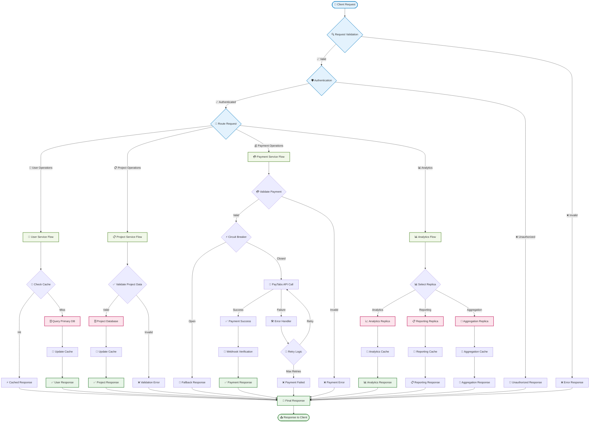
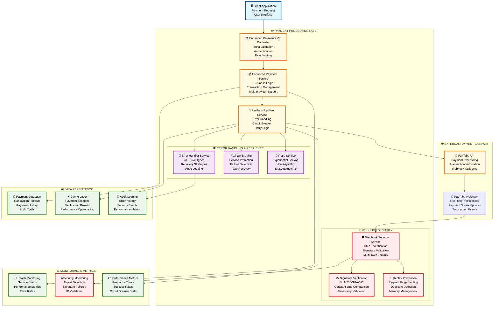
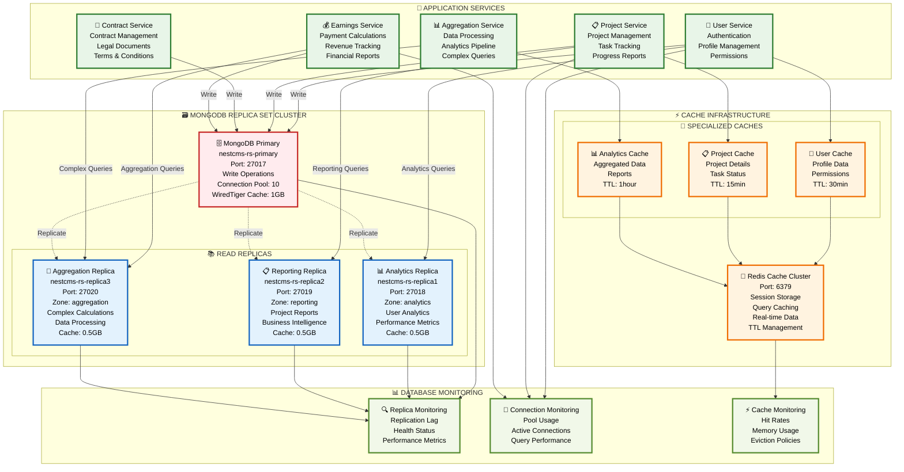

# 🎨 **BEAUTIFUL SYSTEM ARCHITECTURE DIAGRAMS**

## 🏗️ **COMPREHENSIVE NESTCMS SYSTEM ARCHITECTURE**

> **Status: ✅ ENHANCED** - Beautiful, comprehensive architectural diagrams with stunning visual design and detailed component descriptions!

---

## 🌟 **OVERVIEW ARCHITECTURE**

```mermaid
graph TB
    %% Styling
    classDef clientClass fill:#e1f5fe,stroke:#01579b,stroke-width:3px,color:#000
    classDef gatewayClass fill:#f3e5f5,stroke:#4a148c,stroke-width:3px,color:#000
    classDef appClass fill:#e8f5e8,stroke:#1b5e20,stroke-width:3px,color:#000
    classDef serviceClass fill:#fff3e0,stroke:#e65100,stroke-width:3px,color:#000
    classDef dataClass fill:#fce4ec,stroke:#880e4f,stroke-width:3px,color:#000
    classDef cacheClass fill:#f1f8e9,stroke:#33691e,stroke-width:3px,color:#000
    classDef paymentClass fill:#fff8e1,stroke:#ff6f00,stroke-width:3px,color:#000
    classDef monitorClass fill:#e0f2f1,stroke:#00695c,stroke-width:3px,color:#000

    %% Client Layer
    subgraph "🌐 CLIENT ECOSYSTEM"
        WEB[🖥️ Web Dashboard<br/>React/Angular SPA<br/>Real-time Updates]
        MOBILE[📱 Mobile App<br/>React Native<br/>Push Notifications]
        API_CLIENT[🔌 API Clients<br/>Third-party Integrations<br/>Webhook Consumers]
    end

    %% Gateway Layer
    subgraph "🚪 API GATEWAY & SECURITY"
        NGINX[🔒 NGINX Proxy<br/>Load Balancer<br/>SSL Termination<br/>Rate Limiting]
        AUTH[🛡️ Authentication<br/>JWT Tokens<br/>Role-based Access<br/>Session Management]
    end

    %% Application Layer
    subgraph "🏢 NESTCMS APPLICATION LAYER"
        MAIN_APP[🚀 NestJS Application<br/>Port: 3000<br/>Microservices Architecture]
        
        subgraph "📊 CORE SERVICES"
            USER_SVC[👥 User Service<br/>Authentication & Authorization<br/>Profile Management<br/>Permissions & Roles]
            PROJECT_SVC[📋 Project Service<br/>Project Management<br/>Task Tracking<br/>Progress Monitoring]
            CONTRACT_SVC[📄 Contract Service<br/>Contract Management<br/>Terms & Conditions<br/>Legal Compliance]
            EARNING_SVC[💰 Earnings Service<br/>Payment Calculations<br/>Revenue Tracking<br/>Financial Reports]
        end
        
        subgraph "💳 PAYMENT ECOSYSTEM"
            PAYMENT_SVC[💳 Enhanced Payment Service<br/>Multi-provider Support<br/>Transaction Management<br/>Payment History]
            PAYTABS_SVC[🏦 PayTabs Integration<br/>Error Handling & Resilience<br/>Webhook Security<br/>Signature Verification]
            WEBHOOK_SEC[🔐 Webhook Security<br/>HMAC Verification<br/>Replay Prevention<br/>IP Whitelisting]
        end
        
        subgraph "🔧 INFRASTRUCTURE SERVICES"
            CIRCUIT_SVC[⚡ Circuit Breaker<br/>Service Protection<br/>Failure Detection<br/>Auto Recovery]
            CACHE_SVC[🚀 Cache Service<br/>Redis Integration<br/>Performance Optimization<br/>TTL Management]
            HEALTH_SVC[🏥 Health Service<br/>System Monitoring<br/>Service Status<br/>Performance Metrics]
            AGGREGATION_SVC[📈 Aggregation Service<br/>Data Processing<br/>Analytics Pipeline<br/>Report Generation]
        end
    end

    %% Data Layer
    subgraph "🗃️ DATA PERSISTENCE LAYER"
        MONGO_PRIMARY[🗄️ MongoDB Primary<br/>Write Operations<br/>Connection Pool: 10<br/>High Availability]
        
        subgraph "📚 READ REPLICAS"
            MONGO_R1[📊 Analytics Replica<br/>User Analytics<br/>Performance Metrics<br/>Zone: Analytics]
            MONGO_R2[📋 Reporting Replica<br/>Project Reports<br/>Business Intelligence<br/>Zone: Reporting]
            MONGO_R3[🔢 Aggregation Replica<br/>Complex Calculations<br/>Data Processing<br/>Zone: Aggregation]
        end
        
        REDIS_CACHE[⚡ Redis Cache Cluster<br/>Session Storage<br/>Query Caching<br/>Real-time Data]
    end

    %% External Services
    subgraph "🌍 EXTERNAL INTEGRATIONS"
        PAYTABS_API[🏦 PayTabs API<br/>Payment Processing<br/>Transaction Verification<br/>Webhook Callbacks]
        EMAIL_SVC[📧 Email Service<br/>Notifications<br/>Transactional Emails<br/>Marketing Campaigns]
        SMS_SVC[📱 SMS Service<br/>OTP Verification<br/>Alerts & Notifications<br/>Two-factor Auth]
        STORAGE_SVC[☁️ Cloud Storage<br/>File Management<br/>Document Storage<br/>Media Assets]
    end

    %% Monitoring Layer
    subgraph "📊 MONITORING & OBSERVABILITY"
        METRICS[📈 Metrics Collection<br/>Prometheus/Grafana<br/>Performance Monitoring<br/>Custom Dashboards]
        LOGS[📝 Centralized Logging<br/>ELK Stack<br/>Error Tracking<br/>Audit Trails]
        ALERTS[🚨 Alerting System<br/>Real-time Notifications<br/>Incident Management<br/>SLA Monitoring]
    end

    %% Connections
    WEB --> NGINX
    MOBILE --> NGINX
    API_CLIENT --> NGINX
    
    NGINX --> AUTH
    AUTH --> MAIN_APP
    
    MAIN_APP --> USER_SVC
    MAIN_APP --> PROJECT_SVC
    MAIN_APP --> CONTRACT_SVC
    MAIN_APP --> EARNING_SVC
    MAIN_APP --> PAYMENT_SVC
    
    PAYMENT_SVC --> PAYTABS_SVC
    PAYTABS_SVC --> WEBHOOK_SEC
    PAYTABS_SVC --> CIRCUIT_SVC
    
    USER_SVC --> CACHE_SVC
    PROJECT_SVC --> CACHE_SVC
    CONTRACT_SVC --> CACHE_SVC
    EARNING_SVC --> AGGREGATION_SVC
    
    MAIN_APP --> HEALTH_SVC
    HEALTH_SVC --> METRICS
    
    USER_SVC --> MONGO_PRIMARY
    PROJECT_SVC --> MONGO_PRIMARY
    CONTRACT_SVC --> MONGO_PRIMARY
    EARNING_SVC --> MONGO_PRIMARY
    PAYMENT_SVC --> MONGO_PRIMARY
    
    AGGREGATION_SVC --> MONGO_R1
    AGGREGATION_SVC --> MONGO_R2
    AGGREGATION_SVC --> MONGO_R3
    
    CACHE_SVC --> REDIS_CACHE
    
    PAYTABS_SVC --> PAYTABS_API
    MAIN_APP --> EMAIL_SVC
    MAIN_APP --> SMS_SVC
    MAIN_APP --> STORAGE_SVC
    
    MAIN_APP --> LOGS
    HEALTH_SVC --> ALERTS

    %% Apply styles
    class WEB,MOBILE,API_CLIENT clientClass
    class NGINX,AUTH gatewayClass
    class MAIN_APP,USER_SVC,PROJECT_SVC,CONTRACT_SVC,EARNING_SVC appClass
    class CIRCUIT_SVC,CACHE_SVC,HEALTH_SVC,AGGREGATION_SVC serviceClass
    class MONGO_PRIMARY,MONGO_R1,MONGO_R2,MONGO_R3 dataClass
    class REDIS_CACHE cacheClass
    class PAYMENT_SVC,PAYTABS_SVC,WEBHOOK_SEC,PAYTABS_API paymentClass
    class METRICS,LOGS,ALERTS,EMAIL_SVC,SMS_SVC,STORAGE_SVC monitorClass
```

---

## 🔄 **DATA FLOW ARCHITECTURE**

---

## 💳 **PAYMENT PROCESSING ARCHITECTURE**

---

## 🗃️ **DATABASE ARCHITECTURE WITH READ REPLICAS**

