# Business Architecture Diagram

## Construction Management System - Business Flow

```mermaid
graph TB
    %% External Actors
    Client[👤 Client]
    Employee[👨‍💼 Employee/Contractor]
    Admin[👨‍💻 Administrator]
    PayTabs[💳 PayTabs Gateway]
    
    %% Core Business Domains
    subgraph "User Management Domain"
        UM[User Management]
        Auth[Authentication & Authorization]
        Perms[Permissions & Roles]
    end
    
    subgraph "Project Management Domain"
        PM[Project Management]
        PS[Project Steps]
        PD[Project Designs]
        PN[Project Notes]
    end
    
    subgraph "Contract Management Domain"
        CM[Contract Management]
        CO[Contract Offers]
        CE[Contract-Employee Relations]
    end
    
    subgraph "Financial Domain"
        Pay[Payment Processing]
        Earn[Earnings Management]
        Trans[Transaction Tracking]
    end
    
    subgraph "Content Management Domain"
        Art[Articles & Documentation]
        Sched[Scheduling System]
        Org[Organization Management]
    end
    
    %% Business Process Flows
    Client -->|1. Register/Login| Auth
    Employee -->|1. Register/Login| Auth
    Admin -->|1. System Access| Auth
    
    Auth -->|2. Assign Roles| Perms
    Perms -->|3. Access Control| UM
    
    Client -->|4. Request Project| PM
    PM -->|5. Create Contract| CM
    CM -->|6. Generate Offer| CO
    
    Employee -->|7. Accept Contract| CE
    CE -->|8. Assign to Project| PM
    
    PM -->|9. Define Steps| PS
    PM -->|10. Add Designs| PD
    PM -->|11. Track Progress| PN
    
    Client -->|12. Initiate Payment| Pay
    Pay -->|13. Process Payment| PayTabs
    PayTabs -->|14. Callback/Verification| Trans
    Trans -->|15. Update Status| Pay
    
    Pay -->|16. Calculate Earnings| Earn
    Earn -->|17. Distribute Payments| Employee
    
    Admin -->|18. Manage Content| Art
    Admin -->|19. Schedule Tasks| Sched
    Admin -->|20. Organize Structure| Org
    
    %% Data Relationships
    UM -.->|User Data| PM
    UM -.->|User Data| CM
    UM -.->|User Data| Pay
    
    CM -.->|Contract Data| Pay
    PM -.->|Project Data| Earn
    Pay -.->|Payment Data| Earn
    
    style Client fill:#e1f5fe
    style Employee fill:#f3e5f5
    style Admin fill:#fff3e0
    style PayTabs fill:#e8f5e8
```

## Payment Processing Business Flow

## Data Aggregation Business Logic

## Business Entity Relationships

## Business Process Decision Points

## Key Business Rules

### Payment Processing Rules
1. **Payment Verification**: All payments must be verified through PayTabs before status update
2. **Multi-Currency Support**: System supports multiple currencies with proper conversion tracking
3. **Transaction Integrity**: Each payment must have a unique transaction reference
4. **Callback Security**: Payment callbacks must be verified for authenticity

### Contract Management Rules
1. **Employee Assignment**: Contracts must have assigned employees before project initiation
2. **Client Validation**: Only authenticated clients can create payment requests
3. **Status Tracking**: Contract status must reflect current payment and project state
4. **Offer Management**: Contract offers can be modified until acceptance

### Project Execution Rules
1. **Step Dependencies**: Project steps must follow defined sequence and dependencies
2. **Design Integration**: Project designs must be linked to specific project phases
3. **Progress Tracking**: Project progress must be updated based on completed steps
4. **Employee Access**: Only assigned employees can update project status

### Data Aggregation Rules
1. **Performance Optimization**: Complex queries must use aggregation pipelines for efficiency
2. **Data Consistency**: Aggregated data must maintain consistency across related entities
3. **Access Control**: Aggregation results must respect user permissions and data visibility
4. **Caching Strategy**: Frequently accessed aggregations should implement caching mechanisms

This business architecture provides a comprehensive view of the construction management system's business processes, data relationships, and decision flows, enabling stakeholders to understand the system's business value and operational requirements.

