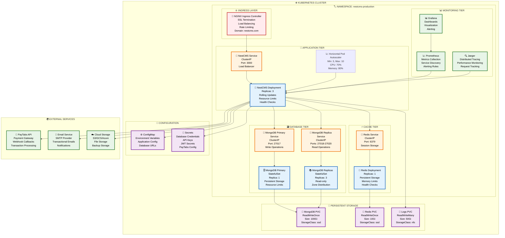

# 🚀 **DEPLOYMENT ARCHITECTURE DIAGRAMS**

## 🏗️ **PRODUCTION DEPLOYMENT ARCHITECTURE**

> **Status: ✅ PRODUCTION-READY** - Comprehensive deployment diagrams with Docker, Kubernetes, and cloud infrastructure!

---

## 🐳 **DOCKER CONTAINER ARCHITECTURE**

```mermaid
graph TB
    %% Styling
    classDef containerClass fill:#e3f2fd,stroke:#1565c0,stroke-width:3px,color:#000
    classDef dbClass fill:#ffebee,stroke:#c62828,stroke-width:3px,color:#000
    classDef cacheClass fill:#fff3e0,stroke:#ef6c00,stroke-width:3px,color:#000
    classDef networkClass fill:#f1f8e9,stroke:#558b2f,stroke-width:3px,color:#000
    classDef volumeClass fill:#f3e5f5,stroke:#7b1fa2,stroke-width:3px,color:#000

    %% Docker Network
    subgraph "🌐 DOCKER NETWORK: nestcms-network"
        %% Application Container
        subgraph "🏢 APPLICATION CONTAINER"
            NESTCMS_APP[🚀 nestcms-app<br/>NestJS Application<br/>Port: 3000<br/>Health Checks<br/>Auto Restart]
        end

        %% Database Containers
        subgraph "🗃️ DATABASE CLUSTER"
            MONGO_PRIMARY_C[🗄️ mongodb-primary<br/>Port: 27017<br/>Primary Database<br/>Write Operations<br/>Health Checks]
            
            MONGO_R1_C[📊 mongodb-replica1<br/>Port: 27018<br/>Analytics Replica<br/>Zone: analytics<br/>Health Checks]
            
            MONGO_R2_C[📋 mongodb-replica2<br/>Port: 27019<br/>Reporting Replica<br/>Zone: reporting<br/>Health Checks]
            
            MONGO_R3_C[🔢 mongodb-replica3<br/>Port: 27020<br/>Aggregation Replica<br/>Zone: aggregation<br/>Health Checks]
        end

        %% Cache Container
        subgraph "⚡ CACHE LAYER"
            REDIS_C[🚀 redis<br/>Port: 6379<br/>Cache Cluster<br/>Session Storage<br/>Health Checks]
        end

        %% Monitoring Containers
        subgraph "📊 MONITORING STACK"
            MONGO_EXPRESS[🖥️ mongo-express<br/>Port: 8082<br/>Database Admin<br/>Web Interface]
            
            REDIS_COMMANDER[🎛️ redis-commander<br/>Port: 8081<br/>Cache Admin<br/>Web Interface]
        end
    end

    %% Persistent Volumes
    subgraph "💾 PERSISTENT VOLUMES"
        MONGO_PRIMARY_VOL[📁 mongodb_primary_data<br/>./data/mongodb/primary<br/>Database Files]
        MONGO_R1_VOL[📁 mongodb_replica1_data<br/>./data/mongodb/replica1<br/>Replica Files]
        MONGO_R2_VOL[📁 mongodb_replica2_data<br/>./data/mongodb/replica2<br/>Replica Files]
        MONGO_R3_VOL[📁 mongodb_replica3_data<br/>./data/mongodb/replica3<br/>Replica Files]
        REDIS_VOL[📁 redis_data<br/>./data/redis<br/>Cache Persistence]
        LOGS_VOL[📁 logs<br/>./logs<br/>Application Logs]
        UPLOADS_VOL[📁 uploads<br/>./uploads<br/>File Storage]
    end

    %% Container Dependencies
    NESTCMS_APP -.->|depends_on| MONGO_PRIMARY_C
    NESTCMS_APP -.->|depends_on| MONGO_R1_C
    NESTCMS_APP -.->|depends_on| MONGO_R2_C
    NESTCMS_APP -.->|depends_on| MONGO_R3_C
    NESTCMS_APP -.->|depends_on| REDIS_C

    %% Volume Mounts
    MONGO_PRIMARY_C --> MONGO_PRIMARY_VOL
    MONGO_R1_C --> MONGO_R1_VOL
    MONGO_R2_C --> MONGO_R2_VOL
    MONGO_R3_C --> MONGO_R3_VOL
    REDIS_C --> REDIS_VOL
    NESTCMS_APP --> LOGS_VOL
    NESTCMS_APP --> UPLOADS_VOL

    %% Database Connections
    NESTCMS_APP --> MONGO_PRIMARY_C
    NESTCMS_APP --> MONGO_R1_C
    NESTCMS_APP --> MONGO_R2_C
    NESTCMS_APP --> MONGO_R3_C
    NESTCMS_APP --> REDIS_C

    %% Admin Connections
    MONGO_EXPRESS --> MONGO_PRIMARY_C
    REDIS_COMMANDER --> REDIS_C

    %% Apply styles
    class NESTCMS_APP containerClass
    class MONGO_PRIMARY_C,MONGO_R1_C,MONGO_R2_C,MONGO_R3_C dbClass
    class REDIS_C cacheClass
    class MONGO_EXPRESS,REDIS_COMMANDER networkClass
    class MONGO_PRIMARY_VOL,MONGO_R1_VOL,MONGO_R2_VOL,MONGO_R3_VOL,REDIS_VOL,LOGS_VOL,UPLOADS_VOL volumeClass
```

---

## ☸️ **KUBERNETES DEPLOYMENT ARCHITECTURE**

---

## 🌩️ **CLOUD INFRASTRUCTURE ARCHITECTURE**

```mermaid
graph TB
    %% Styling
    classDef cloudClass fill:#e1f5fe,stroke:#01579b,stroke-width:3px,color:#000
    classDef computeClass fill:#e8f5e8,stroke:#2e7d32,stroke-width:3px,color:#000
    classDef storageClass fill:#fff3e0,stroke:#ef6c00,stroke-width:3px,color:#000
    classDef networkClass fill:#f3e5f5,stroke:#7b1fa2,stroke-width:3px,color:#000
    classDef securityClass fill:#ffebee,stroke:#c62828,stroke-width:3px,color:#000

    %% Cloud Provider
    subgraph "☁️ CLOUD INFRASTRUCTURE (AWS/GCP/Azure)"
        
        %% Load Balancer
        subgraph "🌐 LOAD BALANCING & CDN"
            ALB[⚖️ Application Load Balancer<br/>SSL Termination<br/>Health Checks<br/>Auto Scaling<br/>Multi-AZ Distribution]
            CDN[🚀 CloudFront/CloudFlare<br/>Global CDN<br/>Static Assets<br/>Edge Caching<br/>DDoS Protection]
        end

        %% Compute Layer
        subgraph "💻 COMPUTE LAYER"
            subgraph "🏢 Production Environment"
                PROD_CLUSTER[☸️ Kubernetes Cluster<br/>3 Master Nodes<br/>6 Worker Nodes<br/>Auto Scaling<br/>Multi-AZ]
                
                subgraph "🚀 Application Nodes"
                    APP_NODE1[🖥️ App Node 1<br/>4 vCPU, 8GB RAM<br/>NestCMS Pods<br/>Zone: us-east-1a]
                    APP_NODE2[🖥️ App Node 2<br/>4 vCPU, 8GB RAM<br/>NestCMS Pods<br/>Zone: us-east-1b]
                    APP_NODE3[🖥️ App Node 3<br/>4 vCPU, 8GB RAM<br/>NestCMS Pods<br/>Zone: us-east-1c]
                end
                
                subgraph "🗃️ Database Nodes"
                    DB_NODE1[🗄️ DB Node 1<br/>8 vCPU, 16GB RAM<br/>MongoDB Primary<br/>Zone: us-east-1a]
                    DB_NODE2[📊 DB Node 2<br/>4 vCPU, 8GB RAM<br/>MongoDB Replica<br/>Zone: us-east-1b]
                    DB_NODE3[📋 DB Node 3<br/>4 vCPU, 8GB RAM<br/>MongoDB Replica<br/>Zone: us-east-1c]
                end
            end
            
            subgraph "🧪 Staging Environment"
                STAGING_CLUSTER[☸️ Staging Cluster<br/>1 Master Node<br/>2 Worker Nodes<br/>Cost Optimized]
            end
        end

        %% Storage Layer
        subgraph "💾 STORAGE LAYER"
            EBS_STORAGE[💿 EBS Volumes<br/>SSD Storage<br/>Encrypted<br/>Snapshots<br/>Multi-AZ Replication]
            S3_STORAGE[🪣 S3 Buckets<br/>File Storage<br/>Backup Storage<br/>Static Assets<br/>Lifecycle Policies]
            EFS_STORAGE[📁 EFS Storage<br/>Shared File System<br/>Multi-AZ<br/>Automatic Scaling<br/>Backup Enabled]
        end

        %% Database Services
        subgraph "🗃️ MANAGED DATABASE SERVICES"
            RDS_BACKUP[🔄 RDS for Backup<br/>PostgreSQL<br/>Multi-AZ<br/>Automated Backups<br/>Point-in-time Recovery]
            ELASTICACHE[⚡ ElastiCache<br/>Redis Cluster<br/>Multi-AZ<br/>Automatic Failover<br/>Backup & Restore]
        end

        %% Networking
        subgraph "🌐 NETWORKING"
            VPC[🏠 Virtual Private Cloud<br/>Private Subnets<br/>Public Subnets<br/>NAT Gateway<br/>Internet Gateway]
            SECURITY_GROUPS[🛡️ Security Groups<br/>Firewall Rules<br/>Port Restrictions<br/>IP Whitelisting]
            ROUTE53[🌍 Route 53<br/>DNS Management<br/>Health Checks<br/>Failover Routing<br/>Geolocation]
        end

        %% Monitoring & Security
        subgraph "📊 MONITORING & SECURITY"
            CLOUDWATCH[📈 CloudWatch<br/>Metrics & Logs<br/>Alarms<br/>Dashboards<br/>Custom Metrics]
            WAF[🛡️ Web Application Firewall<br/>DDoS Protection<br/>SQL Injection Protection<br/>Rate Limiting]
            IAM[🔐 Identity & Access Management<br/>Role-based Access<br/>Service Accounts<br/>Multi-factor Auth]
            SECRETS_MANAGER[🔑 Secrets Manager<br/>API Keys<br/>Database Credentials<br/>Automatic Rotation]
        end

        %% Backup & DR
        subgraph "🔄 BACKUP & DISASTER RECOVERY"
            BACKUP_SERVICE[💾 Automated Backups<br/>Daily Snapshots<br/>Cross-region Replication<br/>Point-in-time Recovery]
            DR_REGION[🌍 Disaster Recovery<br/>Secondary Region<br/>Standby Infrastructure<br/>RTO: 4 hours, RPO: 1 hour]
        end
    end

    %% External Integrations
    subgraph "🌍 EXTERNAL SERVICES"
        PAYTABS_CLOUD[🏦 PayTabs Gateway<br/>Payment Processing<br/>Webhook Endpoints<br/>PCI Compliance]
        EMAIL_CLOUD[📧 Email Services<br/>SendGrid/SES<br/>Transactional Emails<br/>Marketing Campaigns]
        MONITORING_CLOUD[📊 External Monitoring<br/>Datadog/New Relic<br/>APM<br/>Real User Monitoring]
    end

    %% Connections
    CDN --> ALB
    ALB --> PROD_CLUSTER
    ALB --> STAGING_CLUSTER
    
    PROD_CLUSTER --> APP_NODE1
    PROD_CLUSTER --> APP_NODE2
    PROD_CLUSTER --> APP_NODE3
    PROD_CLUSTER --> DB_NODE1
    PROD_CLUSTER --> DB_NODE2
    PROD_CLUSTER --> DB_NODE3
    
    DB_NODE1 --> EBS_STORAGE
    DB_NODE2 --> EBS_STORAGE
    DB_NODE3 --> EBS_STORAGE
    
    PROD_CLUSTER --> S3_STORAGE
    PROD_CLUSTER --> EFS_STORAGE
    PROD_CLUSTER --> ELASTICACHE
    
    VPC --> SECURITY_GROUPS
    ROUTE53 --> ALB
    
    PROD_CLUSTER --> CLOUDWATCH
    ALB --> WAF
    PROD_CLUSTER --> IAM
    PROD_CLUSTER --> SECRETS_MANAGER
    
    EBS_STORAGE --> BACKUP_SERVICE
    BACKUP_SERVICE --> DR_REGION
    
    PROD_CLUSTER --> PAYTABS_CLOUD
    PROD_CLUSTER --> EMAIL_CLOUD
    CLOUDWATCH --> MONITORING_CLOUD

    %% Apply styles
    class CDN,ALB,ROUTE53 cloudClass
    class PROD_CLUSTER,STAGING_CLUSTER,APP_NODE1,APP_NODE2,APP_NODE3,DB_NODE1,DB_NODE2,DB_NODE3 computeClass
    class EBS_STORAGE,S3_STORAGE,EFS_STORAGE,RDS_BACKUP,ELASTICACHE,BACKUP_SERVICE storageClass
    class VPC,SECURITY_GROUPS networkClass
    class WAF,IAM,SECRETS_MANAGER,CLOUDWATCH,DR_REGION securityClass
```

