# Enhanced Deep-Level Architecture with Resilience Patterns

## Enhanced PayTabs Integration with Circuit Breakers & Event-Driven Architecture

### Comprehensive PayTabs Integration Flow

```mermaid
graph TB
    subgraph "Client Layer"
        WebApp[🌐 Web Application]
        MobileApp[📱 Mobile Application]
        APIClient[🔌 API Client]
        WebhookClient[🔗 Webhook Client]
    end
    
    subgraph "Enhanced NestJS Application Layer"
        subgraph "API Gateway & Security"
            Router[🚪 Express Router]
            CORS[🌐 CORS Middleware]
            RateLimit[🚦 Rate Limiting]
            Auth[🔑 JWT Authentication]
            WAF[🛡️ Web Application Firewall]
        end
        
        subgraph "Enhanced Payment Module"
            PayController[💰 Payment Controller]
            PayControllerV2[💳 Enhanced Payment Controller v2]
            PayService[💰 Payment Service]
            EnhancedPayService[💳 Enhanced Payment Service]
            PayTabService[💳 PayTabs Service]
            EnhancedPayTabService[🛡️ Enhanced PayTabs Service]
            PayModel[📄 Payment Model]
            WebhookSecurityService[🔐 Webhook Security Service]
        end
        
        subgraph "Circuit Breaker Layer"
            CircuitBreakerService[🔄 Circuit Breaker Service]
            PayTabsCircuitBreaker[⚡ PayTabs Circuit Breaker]
            DatabaseCircuitBreaker[⚡ Database Circuit Breaker]
            CacheCircuitBreaker[⚡ Cache Circuit Breaker]
        end
        
        subgraph "Event-Driven Architecture"
            EventEmitter[📡 Event Emitter]
            PaymentEvents[💳 Payment Events]
            CircuitBreakerEvents[⚡ Circuit Breaker Events]
            WebhookEvents[🔐 Webhook Events]
            SystemEvents[🖥️ System Events]
        end
        
        subgraph "Enhanced Security Layer"
            WebhookValidator[✅ Webhook Validator]
            SignatureVerifier[✍️ HMAC Signature Verifier]
            TimestampValidator[⏰ Timestamp Validator]
            IPWhitelistValidator[🌐 IP Whitelist Validator]
            RetryMechanism[🔄 Retry Logic with Backoff]
        end
        
        subgraph "Data Validation & Processing"
            PaymentDTO[📋 Payment DTO]
            ValidationPipe[✅ Validation Pipe]
            TransformPipe[🔄 Transform Pipe]
            SanitizationPipe[🧹 Sanitization Pipe]
        end
        
        subgraph "Caching & Performance"
            CacheService[🗄️ Cache Service]
            QueryCache[🔍 Query Cache]
            RedisCache[⚡ Redis Cache]
            CompressionService[📦 Compression Service]
        end
    end
    
    subgraph "Enhanced External PayTabs Gateway"
        subgraph "PayTabs API Endpoints"
            CreatePage[📄 Create Payment Page]
            ProcessPayment[💳 Process Payment]
            VerifyTransaction[✅ Verify Transaction]
            WebhookEndpoint[🔗 Webhook Callback]
            RefundAPI[💸 Refund API]
            StatusAPI[📊 Status API]
        end
        
        subgraph "Payment Gateway Infrastructure"
            PaymentProcessor[💳 Payment Processor]
            BankConnections[🏦 Bank Connections]
            CardNetworks[💳 Card Networks]
            SecurityLayer[🔒 Gateway Security]
        end
    end
    
    subgraph "Enhanced Data Layer"
        subgraph "MongoDB Cluster"
            Primary[(🍃 Primary DB)]
            ReadReplica1[(📖 Read Replica 1)]
            ReadReplica2[(📖 Read Replica 2)]
            ReadReplica3[(📖 Read Replica 3)]
        end
        
        subgraph "Redis Cluster"
            RedisMaster[(⚡ Redis Master)]
            RedisSlave1[(📖 Redis Slave 1)]
            RedisSlave2[(📖 Redis Slave 2)]
        end
        
        subgraph "Database Configuration"
            DatabaseConfig[⚙️ Database Config Service]
            ConnectionPool[🏊 Connection Pool]
            ReadWriteSplitter[📊 Read/Write Splitter]
        end
    end
    
    subgraph "Monitoring & Observability"
        HealthController[🏥 Health Controller]
        MetricsCollector[📊 Metrics Collector]
        LoggingService[📝 Logging Service]
        AlertManager[🚨 Alert Manager]
        Dashboard[📈 Monitoring Dashboard]
    end
```

### Enhanced Payment Processing Sequence

```mermaid
sequenceDiagram
    participant C as 👤 Client
    participant API as 🚪 API Gateway
    participant Auth as 🔑 Auth Service
    participant PayV2 as 💳 Payment Controller v2
    participant EPS as 💳 Enhanced Payment Service
    participant CB as 🔄 Circuit Breaker
    participant EPTS as 🛡️ Enhanced PayTabs Service
    participant Cache as ⚡ Redis Cache
    participant EE as 📡 Event Emitter
    participant PT as 💳 PayTabs Gateway
    participant WS as 🔐 Webhook Security
    participant DB as 🍃 Database
    
    Note over C,DB: Enhanced Payment Creation Flow
    
    C->>API: 1. POST /payments/v2/create
    API->>Auth: 2. Validate JWT Token
    Auth-->>API: 3. Token Valid
    API->>PayV2: 4. Route to Enhanced Controller
    PayV2->>EPS: 5. Create Payment Request
    
    EPS->>Cache: 6. Check Payment Cache
    Cache-->>EPS: 7. Cache Miss
    EPS->>EE: 8. Emit PaymentCreatedEvent
    EPS->>DB: 9. Save Payment Record
    DB-->>EPS: 10. Payment Saved
    
    EPS->>CB: 11. Check Circuit Breaker State
    CB-->>EPS: 12. Circuit Closed (Healthy)
    EPS->>EPTS: 13. Create PayTabs Payment Page
    
    EPTS->>CB: 14. Execute with Circuit Protection
    CB->>PT: 15. PayTabs API Call
    PT-->>CB: 16. Payment Page Response
    CB-->>EPTS: 17. Success Response
    
    EPTS->>EE: 18. Emit PaymentInitiatedEvent
    EPTS->>Cache: 19. Cache Payment Data
    EPTS-->>EPS: 20. Payment Page URL
    EPS-->>PayV2: 21. Payment Response
    PayV2-->>API: 22. API Response
    API-->>C: 23. Payment Page URL
    
    Note over C,DB: Payment Processing & Webhook Flow
    
    C->>PT: 24. Complete Payment on PayTabs
    PT->>API: 25. Webhook Callback
    API->>WS: 26. Validate Webhook Security
    
    WS->>WS: 27. Verify HMAC Signature
    WS->>WS: 28. Validate Timestamp
    WS->>WS: 29. Check IP Whitelist
    WS-->>API: 30. Validation Success
    
    API->>PayV2: 31. Process Webhook
    PayV2->>EPS: 32. Handle Webhook Data
    EPS->>EE: 33. Emit WebhookReceivedEvent
    
    EPS->>EPTS: 34. Verify Payment Status
    EPTS->>CB: 35. Verify with Circuit Protection
    CB->>PT: 36. Verification API Call
    PT-->>CB: 37. Payment Verified
    CB-->>EPTS: 38. Verification Success
    
    EPTS->>EE: 39. Emit PaymentSuccessEvent
    EPS->>DB: 40. Update Payment Status
    EPS->>Cache: 41. Update Cache
    EPS->>EE: 42. Emit StatusChangedEvent
    
    EPS-->>PayV2: 43. Webhook Processed
    PayV2-->>API: 44. Success Response
    API-->>PT: 45. Webhook Acknowledgment
    
    Note over C,DB: Circuit Breaker Failure Handling
    
    alt Circuit Breaker Open
        EPS->>CB: Check Circuit State
        CB-->>EPS: Circuit Open (Service Down)
        EPS->>EE: Emit ServiceUnavailableEvent
        EPS-->>PayV2: Fallback Response
        PayV2-->>API: Service Unavailable
        API-->>C: Temporary Service Issue
    end
    
    alt Circuit Breaker Recovery
        CB->>CB: Reset Timeout Reached
        CB->>PT: Test Request
        PT-->>CB: Success Response
        CB->>CB: Close Circuit
        CB->>EE: Emit CircuitClosedEvent
    end
```

### Enhanced Database Aggregation Architecture

```mermaid
graph TB
    subgraph "Application Services Layer"
        US[👤 Users Service]
        PS[🏗️ Projects Service]
        CS[📋 Contracts Service]
        ES[💵 Earnings Service]
        OCS[⚡ Optimized Contracts Service]
        OES[⚡ Optimized Earnings Service]
        AS[🔍 Aggregation Service]
    end
    
    subgraph "Circuit Breaker Protection"
        DBCB[⚡ Database Circuit Breaker]
        CacheCB[⚡ Cache Circuit Breaker]
        CBCB[🔄 Circuit Breaker Controller]
    end
    
    subgraph "Caching Layer"
        CacheService[🗄️ Cache Service]
        QueryCache[🔍 Query Result Cache]
        RedisCache[⚡ Redis Cache]
        CompressionEngine[📦 Compression Engine]
    end
    
    subgraph "Database Optimization Layer"
        ReadWriteSplitter[📊 Read/Write Splitter]
        ConnectionPool[🏊 Connection Pool Manager]
        QueryOptimizer[⚡ Query Optimizer]
        IndexAnalyzer[📊 Index Analyzer]
    end
    
    subgraph "MongoDB Cluster with Read Replicas"
        Primary[(🍃 Primary Database)]
        Secondary1[(📖 Read Replica 1)]
        Secondary2[(📖 Read Replica 2)]
        Secondary3[(📖 Read Replica 3)]
        Arbiter[(⚖️ Arbiter Node)]
    end
    
    subgraph "Aggregation Pipelines"
        UserLookups[👤 User Aggregations]
        ProjectRelations[🏗️ Project Relations]
        ContractEmployees[📋 Contract-Employee Lookups]
        EarningsCalculations[💵 Earnings Calculations]
        StatisticsAggregations[📊 Statistics Aggregations]
    end
    
    subgraph "Performance Monitoring"
        QueryAnalytics[📈 Query Performance Analytics]
        CacheMetrics[📊 Cache Hit/Miss Metrics]
        DatabaseMetrics[🗄️ Database Performance Metrics]
        OptimizationSuggestions[💡 Optimization Suggestions]
    end
    
    %% Service to Circuit Breaker Flow
    US --> DBCB
    PS --> DBCB
    CS --> DBCB
    ES --> DBCB
    OCS --> DBCB
    OES --> DBCB
    AS --> DBCB
    
    %% Circuit Breaker to Cache
    DBCB --> CacheCB
    CacheCB --> CacheService
    CacheService --> QueryCache
    QueryCache --> RedisCache
    RedisCache --> CompressionEngine
    
    %% Optimized Services Flow
    CS --> OCS
    ES --> OES
    OCS --> AS
    OES --> AS
    AS --> CacheService
    
    %% Database Connection Flow
    DBCB --> ReadWriteSplitter
    ReadWriteSplitter --> ConnectionPool
    ConnectionPool --> QueryOptimizer
    QueryOptimizer --> IndexAnalyzer
    
    %% Read/Write Splitting
    ReadWriteSplitter --> Primary
    ReadWriteSplitter --> Secondary1
    ReadWriteSplitter --> Secondary2
    ReadWriteSplitter --> Secondary3
    
    %% Aggregation Pipeline Routing
    UserLookups --> Secondary1
    ProjectRelations --> Secondary2
    ContractEmployees --> Secondary1
    EarningsCalculations --> Secondary3
    StatisticsAggregations --> Secondary2
    
    %% Write Operations
    US --> Primary
    PS --> Primary
    CS --> Primary
    ES --> Primary
    
    %% Performance Monitoring
    QueryOptimizer --> QueryAnalytics
    CacheService --> CacheMetrics
    ConnectionPool --> DatabaseMetrics
    QueryAnalytics --> OptimizationSuggestions
    
    %% Circuit Breaker Control
    CBCB --> DBCB
    CBCB --> CacheCB
    
    %% Replica Set Configuration
    Primary -.-> Arbiter
    Secondary1 -.-> Arbiter
    Secondary2 -.-> Arbiter
    Secondary3 -.-> Arbiter
    
    %% Styling
    style Primary fill:#00b894,stroke:#00a085,stroke-width:3px
    style Secondary1 fill:#81c784,stroke:#4caf50,stroke-width:2px
    style Secondary2 fill:#81c784,stroke:#4caf50,stroke-width:2px
    style Secondary3 fill:#81c784,stroke:#4caf50,stroke-width:2px
    style DBCB fill:#e17055,stroke:#d63031,stroke-width:2px
    style CacheCB fill:#e17055,stroke:#d63031,stroke-width:2px
    style AS fill:#fdcb6e,stroke:#e17055,stroke-width:2px
    style CacheService fill:#74b9ff,stroke:#0984e3,stroke-width:2px
```

