# Enhanced System Architecture with Resilience Patterns

## Comprehensive NestCMS Architecture with Circuit Breakers & Event-Driven Design

```mermaid
graph TB
    %% Client Layer
    subgraph "Client Layer"
        Web[🌐 Web Application]
        Mobile[📱 Mobile App]
        API[🔌 API Clients]
        Webhook[🔗 External Webhooks]
    end
    
    %% Infrastructure & Security Layer
    subgraph "Infrastructure & Security Layer"
        WAF[🛡️ Web Application Firewall]
        LB[⚖️ Load Balancer]
        Gateway[🚪 API Gateway]
        RateLimit[🚦 Rate Limiter]
        Auth[🔐 Authentication Service]
    end
    
    %% Application Layer with Circuit Breakers
    subgraph "Enhanced NestJS Application Layer"
        subgraph "Controllers Layer"
            UC[👥 Users Controller]
            PC[🏗️ Projects Controller]
            CC[📋 Contracts Controller]
            PayC[💰 Payments Controller]
            PayC2[💳 Enhanced Payments v2]
            HC[🏥 Health Controller]
            AC[📄 Articles Controller]
        end
        
        subgraph "Circuit Breaker Layer"
            CB[🔄 Circuit Breaker Service]
            CBPayTabs[⚡ PayTabs Circuit Breaker]
            CBDatabase[⚡ Database Circuit Breaker]
            CBCache[⚡ Cache Circuit Breaker]
        end
        
        subgraph "Enhanced Services Layer"
            US[👤 Users Service]
            PS[🏗️ Projects Service]
            CS[📋 Contracts Service]
            PayS[💰 Payment Service]
            EPayS[💳 Enhanced Payment Service]
            PTS[💳 PayTabs Service]
            EPTS[🛡️ Enhanced PayTabs Service]
            ES[💵 Earnings Service]
            OES[⚡ Optimized Earnings Service]
            OCS[⚡ Optimized Contracts Service]
            AS[🔍 Aggregation Service]
            CacheS[🗄️ Cache Service]
            WebhookS[🔐 Webhook Security Service]
        end
        
        subgraph "Event System"
            EventEmitter[📡 Event Emitter]
            PaymentEvents[💳 Payment Events]
            CircuitEvents[⚡ Circuit Breaker Events]
            WebhookEvents[🔐 Webhook Events]
            SystemEvents[🖥️ System Events]
        end
        
        subgraph "Security & Middleware"
            JG[🔑 JWT Guard]
            PG[🛡️ Permission Guard]
            WSV[🔐 Webhook Signature Validator]
            IPFilter[🌐 IP Filter]
            TimestampV[⏰ Timestamp Validator]
            Log[📝 Logger Middleware]
        end
    end
    
    %% Data Layer with Optimization
    subgraph "Enhanced Data Layer"
        subgraph "MongoDB Cluster with Read Replicas"
            Primary[(🍃 Primary DB)]
            Replica1[(📖 Read Replica 1)]
            Replica2[(📖 Read Replica 2)]
            Replica3[(📖 Read Replica 3)]
        end
        
        subgraph "Caching & Performance Layer"
            Redis[(⚡ Redis Cache)]
            RedisCluster[(🔄 Redis Cluster)]
            MemCache[(💾 Memory Cache)]
            QueryCache[(🔍 Query Cache)]
        end
        
        subgraph "Database Configuration"
            DBConfig[⚙️ Database Config Service]
            ConnPool[🏊 Connection Pool]
            ReadWriteSplit[📊 Read/Write Splitter]
        end
    end
    
    %% External Services with Resilience
    subgraph "External Services Layer"
        subgraph "Payment Gateway"
            PayTabs[💳 PayTabs Gateway]
            PayTabsAPI[🔌 PayTabs API]
            PayTabsWebhook[🔗 PayTabs Webhooks]
        end
        
        subgraph "Communication Services"
            Email[📧 Email Service]
            SMS[📱 SMS Service]
            Push[🔔 Push Notifications]
        end
        
        subgraph "Storage & CDN"
            FileStorage[📁 File Storage]
            CDN[🌐 CDN]
            Backup[💾 Backup Service]
        end
    end
    
    %% Monitoring & Observability
    subgraph "Monitoring & Observability"
        HealthChecks[🏥 Health Checks]
        Metrics[📊 Metrics Collection]
        Logging[📝 Centralized Logging]
        Alerts[🚨 Alert Manager]
        Dashboard[📈 Monitoring Dashboard]
    end
    
    %% Client Connections
    Web --> WAF
    Mobile --> WAF
    API --> WAF
    Webhook --> WAF
    
    %% Infrastructure Flow
    WAF --> LB
    LB --> Gateway
    Gateway --> RateLimit
    RateLimit --> Auth
    
    %% Controller Routing
    Auth --> UC
    Auth --> PC
    Auth --> CC
    Auth --> PayC
    Auth --> PayC2
    Auth --> HC
    Auth --> AC
    
    %% Circuit Breaker Integration
    CB --> CBPayTabs
    CB --> CBDatabase
    CB --> CBCache
    
    %% Service Layer Connections
    UC --> US
    PC --> PS
    CC --> CS
    CC --> OCS
    PayC --> PayS
    PayC2 --> EPayS
    PayC2 --> EPTS
    PayC --> PTS
    PayC2 --> WebhookS
    
    %% Enhanced PayTabs Integration
    EPTS --> CBPayTabs
    CBPayTabs --> PayTabsAPI
    PayTabsAPI --> PayTabs
    PayTabsWebhook --> WebhookS
    WebhookS --> EPayS
    
    %% Event System Connections
    EPayS --> EventEmitter
    EPTS --> EventEmitter
    CB --> EventEmitter
    EventEmitter --> PaymentEvents
    EventEmitter --> CircuitEvents
    EventEmitter --> WebhookEvents
    EventEmitter --> SystemEvents
    
    %% Security Layer
    PayC2 --> WSV
    PayC2 --> IPFilter
    PayC2 --> TimestampV
    WSV --> WebhookS
    
    %% Optimized Services
    ES --> OES
    CS --> OCS
    OES --> AS
    OCS --> AS
    AS --> CacheS
    
    %% Database Connections with Circuit Breakers
    US --> CBDatabase
    PS --> CBDatabase
    CS --> CBDatabase
    EPayS --> CBDatabase
    OES --> CBDatabase
    OCS --> CBDatabase
    
    CBDatabase --> Primary
    CBDatabase --> ReadWriteSplit
    ReadWriteSplit --> Primary
    ReadWriteSplit --> Replica1
    ReadWriteSplit --> Replica2
    ReadWriteSplit --> Replica3
    
    %% Cache Connections
    CacheS --> CBCache
    CBCache --> Redis
    CBCache --> RedisCluster
    AS --> QueryCache
    
    %% Database Configuration
    DBConfig --> ConnPool
    ConnPool --> Primary
    ConnPool --> Replica1
    ConnPool --> Replica2
    ConnPool --> Replica3
    
    %% External Service Connections
    US --> Email
    EPayS --> Push
    PS --> FileStorage
    FileStorage --> CDN
    
    %% Monitoring Connections
    HC --> HealthChecks
    CB --> Metrics
    EventEmitter --> Logging
    HealthChecks --> Alerts
    Metrics --> Dashboard
    Logging --> Dashboard
    
    %% Styling
    style CB fill:#ff6b6b,stroke:#d63031,stroke-width:3px
    style CBPayTabs fill:#fd79a8,stroke:#e84393,stroke-width:2px
    style CBDatabase fill:#fd79a8,stroke:#e84393,stroke-width:2px
    style CBCache fill:#fd79a8,stroke:#e84393,stroke-width:2px
    style EventEmitter fill:#74b9ff,stroke:#0984e3,stroke-width:3px
    style WebhookS fill:#00b894,stroke:#00a085,stroke-width:2px
    style EPTS fill:#fdcb6e,stroke:#e17055,stroke-width:2px
    style EPayS fill:#fdcb6e,stroke:#e17055,stroke-width:2px
    style Primary fill:#00b894,stroke:#00a085,stroke-width:2px
    style Redis fill:#e17055,stroke:#d63031,stroke-width:2px
    style PayTabs fill:#a29bfe,stroke:#6c5ce7,stroke-width:2px
```

## Enhanced PayTabs Integration Flow with Circuit Breakers

```mermaid
sequenceDiagram
    participant C as 👤 Client
    participant API as 🚪 API Gateway
    participant CB as 🔄 Circuit Breaker
    participant EPS as 💳 Enhanced Payment Service
    participant EPTS as 🛡️ Enhanced PayTabs Service
    participant WS as 🔐 Webhook Security
    participant PT as 💳 PayTabs Gateway
    participant EE as 📡 Event Emitter
    participant Cache as ⚡ Redis Cache
    
    Note over C,Cache: Enhanced Payment Processing Flow
    
    C->>API: 1. Create Payment Request
    API->>EPS: 2. Process Payment
    EPS->>Cache: 3. Check Cache
    Cache-->>EPS: 4. Cache Miss
    EPS->>EE: 5. Emit PaymentCreatedEvent
    
    C->>API: 6. Initiate Payment
    API->>EPS: 7. Process Payment
    EPS->>CB: 8. Check Circuit State
    CB-->>EPS: 9. Circuit Closed (Healthy)
    
    EPS->>EPTS: 10. Create Payment Page
    EPTS->>CB: 11. Execute with Circuit Breaker
    CB->>PT: 12. PayTabs API Call
    PT-->>CB: 13. Payment URL Response
    CB-->>EPTS: 14. Success Response
    EPTS->>EE: 15. Emit PaymentInitiatedEvent
    EPTS-->>EPS: 16. Payment URL
    EPS-->>API: 17. Payment URL
    API-->>C: 18. Redirect to Payment
    
    C->>PT: 19. Complete Payment
    PT->>API: 20. Webhook Callback
    API->>WS: 21. Validate Webhook
    WS->>WS: 22. Verify HMAC Signature
    WS->>WS: 23. Check Timestamp
    WS->>WS: 24. Validate IP Address
    WS-->>API: 25. Validation Success
    
    API->>EPS: 26. Process Webhook
    EPS->>EE: 27. Emit WebhookReceivedEvent
    EPS->>EPTS: 28. Verify Payment
    EPTS->>CB: 29. Verify with Circuit Breaker
    CB->>PT: 30. Verification API Call
    PT-->>CB: 31. Verification Response
    CB-->>EPTS: 32. Verification Success
    
    EPTS->>EE: 33. Emit PaymentSuccessEvent
    EPS->>Cache: 34. Update Cache
    EPS->>EE: 35. Emit StatusChangedEvent
    EPS-->>API: 36. Success Response
    API-->>PT: 37. Webhook Acknowledgment
    
    Note over C,Cache: Circuit Breaker Failure Scenario
    
    alt Circuit Breaker Open
        EPS->>CB: Check Circuit State
        CB-->>EPS: Circuit Open (Service Down)
        EPS->>EE: Emit ServiceUnavailableEvent
        EPS-->>API: Fallback Response
        API-->>C: Service Temporarily Unavailable
    end
    
    alt Circuit Breaker Half-Open
        EPS->>CB: Check Circuit State
        CB-->>EPS: Circuit Half-Open (Testing)
        CB->>PT: Test API Call
        alt Test Success
            PT-->>CB: Success Response
            CB->>CB: Close Circuit
            CB->>EE: Emit CircuitClosedEvent
        else Test Failure
            PT-->>CB: Error Response
            CB->>CB: Open Circuit
            CB->>EE: Emit CircuitOpenedEvent
        end
    end
```

## Event-Driven Architecture Flow

## Circuit Breaker State Management

## Enhanced Security Architecture

```mermaid
graph TB
    subgraph "External Threats"
        Attacker[🏴‍☠️ Malicious Actor]
        Bot[🤖 Automated Bot]
        Replay[🔄 Replay Attack]
        Spoofing[🎭 IP Spoofing]
    end
    
    subgraph "Security Perimeter"
        WAF[🛡️ Web Application Firewall]
        DDoSProtection[🛡️ DDoS Protection]
        IPFiltering[🌐 IP Filtering]
        RateLimiting[🚦 Rate Limiting]
    end
    
    subgraph "Application Security Layer"
        subgraph "Authentication & Authorization"
            JWTAuth[🔑 JWT Authentication]
            RBAC[👥 Role-Based Access Control]
            PermissionGuard[🛡️ Permission Guard]
            SessionManagement[🔐 Session Management]
        end
        
        subgraph "Webhook Security"
            SignatureValidation[✍️ HMAC Signature Validation]
            TimestampValidation[⏰ Timestamp Validation]
            IPWhitelisting[📋 IP Whitelisting]
            HeaderValidation[📋 Header Validation]
            PayloadValidation[📦 Payload Validation]
        end
        
        subgraph "Data Protection"
            Encryption[🔒 Data Encryption]
            Hashing[#️⃣ Password Hashing]
            Sanitization[🧹 Input Sanitization]
            Validation[✅ Data Validation]
        end
    end
    
    subgraph "Monitoring & Response"
        SecurityMonitoring[👁️ Security Monitoring]
        ThreatDetection[🔍 Threat Detection]
        IncidentResponse[🚨 Incident Response]
        AuditLogging[📋 Audit Logging]
        AlertSystem[🚨 Alert System]
    end
    
    subgraph "Secure Data Storage"
        EncryptedDB[(🔒 Encrypted Database)]
        SecureCache[(🔐 Secure Cache)]
        AuditTrail[(📋 Audit Trail)]
        BackupEncryption[💾 Encrypted Backups]
    end
    
    %% Attack Vectors
    Attacker -.->|Attempts| WAF
    Bot -.->|Automated Requests| DDoSProtection
    Replay -.->|Replay Attack| TimestampValidation
    Spoofing -.->|IP Spoofing| IPWhitelisting
    
    %% Security Perimeter
    WAF --> IPFiltering
    DDoSProtection --> RateLimiting
    IPFiltering --> JWTAuth
    RateLimiting --> JWTAuth
    
    %% Authentication Flow
    JWTAuth --> RBAC
    RBAC --> PermissionGuard
    PermissionGuard --> SessionManagement
    
    %% Webhook Security Flow
    SignatureValidation --> TimestampValidation
    TimestampValidation --> IPWhitelisting
    IPWhitelisting --> HeaderValidation
    HeaderValidation --> PayloadValidation
    
    %% Data Protection
    Encryption --> EncryptedDB
    Hashing --> EncryptedDB
    Sanitization --> Validation
    Validation --> EncryptedDB
    
    %% Monitoring Integration
    JWTAuth --> SecurityMonitoring
    SignatureValidation --> SecurityMonitoring
    IPWhitelisting --> ThreatDetection
    SecurityMonitoring --> IncidentResponse
    ThreatDetection --> AlertSystem
    
    %% Audit and Logging
    PermissionGuard --> AuditLogging
    PayloadValidation --> AuditLogging
    IncidentResponse --> AuditTrail
    AuditLogging --> AuditTrail
    
    %% Secure Storage
    EncryptedDB --> BackupEncryption
    SecureCache --> BackupEncryption
    
    %% Styling
    style WAF fill:#e17055,stroke:#d63031,stroke-width:3px
    style SignatureValidation fill:#00b894,stroke:#00a085,stroke-width:2px
    style TimestampValidation fill:#00b894,stroke:#00a085,stroke-width:2px
    style IPWhitelisting fill:#00b894,stroke:#00a085,stroke-width:2px
    style JWTAuth fill:#74b9ff,stroke:#0984e3,stroke-width:2px
    style RBAC fill:#74b9ff,stroke:#0984e3,stroke-width:2px
    style EncryptedDB fill:#a29bfe,stroke:#6c5ce7,stroke-width:2px
    style SecurityMonitoring fill:#fdcb6e,stroke:#e17055,stroke-width:2px
```

## Performance Optimization Architecture

```mermaid
graph TB
    subgraph "Client Requests"
        WebClient[🌐 Web Client]
        MobileClient[📱 Mobile Client]
        APIClient[🔌 API Client]
    end
    
    subgraph "Performance Layer"
        subgraph "Caching Strategy"
            CDN[🌐 CDN Cache]
            APICache[🔄 API Response Cache]
            QueryCache[🔍 Query Result Cache]
            SessionCache[👤 Session Cache]
        end
        
        subgraph "Load Balancing"
            LoadBalancer[⚖️ Load Balancer]
            HealthCheck[🏥 Health Checks]
            AutoScaling[📈 Auto Scaling]
        end
        
        subgraph "Database Optimization"
            ReadReplicas[📖 Read Replicas]
            WriteOptimization[✍️ Write Optimization]
            IndexOptimization[📊 Index Optimization]
            QueryOptimization[⚡ Query Optimization]
        end
    end
    
    subgraph "Application Performance"
        subgraph "Circuit Breakers"
            PayTabsCB[💳 PayTabs Circuit Breaker]
            DatabaseCB[🗄️ Database Circuit Breaker]
            CacheCB[⚡ Cache Circuit Breaker]
            ExternalCB[🌐 External Services CB]
        end
        
        subgraph "Optimized Services"
            OptimizedAggregation[⚡ Optimized Aggregation]
            OptimizedContracts[📋 Optimized Contracts]
            OptimizedEarnings[💵 Optimized Earnings]
            CacheService[🗄️ Cache Service]
        end
        
        subgraph "Performance Monitoring"
            MetricsCollection[📊 Metrics Collection]
            PerformanceAnalytics[📈 Performance Analytics]
            BottleneckDetection[🔍 Bottleneck Detection]
            OptimizationSuggestions[💡 Optimization Suggestions]
        end
    end
    
    subgraph "Data Layer Performance"
        subgraph "MongoDB Cluster"
            Primary[(🍃 Primary)]
            Secondary1[(📖 Secondary 1)]
            Secondary2[(📖 Secondary 2)]
            Secondary3[(📖 Secondary 3)]
        end
        
        subgraph "Redis Cluster"
            RedisMaster[(⚡ Redis Master)]
            RedisSlave1[(📖 Redis Slave 1)]
            RedisSlave2[(📖 Redis Slave 2)]
        end
        
        subgraph "Connection Management"
            ConnectionPool[🏊 Connection Pool]
            ReadWriteSplitter[📊 Read/Write Splitter]
            LoadDistribution[⚖️ Load Distribution]
        end
    end
    
    %% Client to Performance Layer
    WebClient --> CDN
    MobileClient --> CDN
    APIClient --> CDN
    CDN --> LoadBalancer
    
    %% Load Balancing
    LoadBalancer --> HealthCheck
    HealthCheck --> AutoScaling
    LoadBalancer --> APICache
    
    %% Caching Flow
    APICache --> QueryCache
    QueryCache --> SessionCache
    SessionCache --> OptimizedAggregation
    
    %% Circuit Breaker Integration
    OptimizedAggregation --> PayTabsCB
    OptimizedContracts --> DatabaseCB
    OptimizedEarnings --> CacheCB
    CacheService --> ExternalCB
    
    %% Optimized Services
    OptimizedAggregation --> OptimizedContracts
    OptimizedContracts --> OptimizedEarnings
    OptimizedEarnings --> CacheService
    
    %% Database Performance
    DatabaseCB --> ReadWriteSplitter
    ReadWriteSplitter --> Primary
    ReadWriteSplitter --> Secondary1
    ReadWriteSplitter --> Secondary2
    ReadWriteSplitter --> Secondary3
    
    %% Cache Performance
    CacheCB --> RedisMaster
    RedisMaster --> RedisSlave1
    RedisMaster --> RedisSlave2
    
    %% Connection Management
    ConnectionPool --> LoadDistribution
    LoadDistribution --> Primary
    LoadDistribution --> Secondary1
    LoadDistribution --> Secondary2
    
    %% Performance Monitoring
    OptimizedAggregation --> MetricsCollection
    DatabaseCB --> PerformanceAnalytics
    CacheCB --> BottleneckDetection
    MetricsCollection --> OptimizationSuggestions
    
    %% Performance Metrics Flow
    PerformanceAnalytics --> MetricsCollection
    BottleneckDetection --> OptimizationSuggestions
    OptimizationSuggestions --> AutoScaling
    
    %% Styling
    style CDN fill:#74b9ff,stroke:#0984e3,stroke-width:2px
    style LoadBalancer fill:#00b894,stroke:#00a085,stroke-width:2px
    style OptimizedAggregation fill:#fdcb6e,stroke:#e17055,stroke-width:2px
    style PayTabsCB fill:#e17055,stroke:#d63031,stroke-width:2px
    style DatabaseCB fill:#e17055,stroke:#d63031,stroke-width:2px
    style CacheCB fill:#e17055,stroke:#d63031,stroke-width:2px
    style Primary fill:#00b894,stroke:#00a085,stroke-width:2px
    style RedisMaster fill:#e17055,stroke:#d63031,stroke-width:2px
    style MetricsCollection fill:#a29bfe,stroke:#6c5ce7,stroke-width:2px
```

