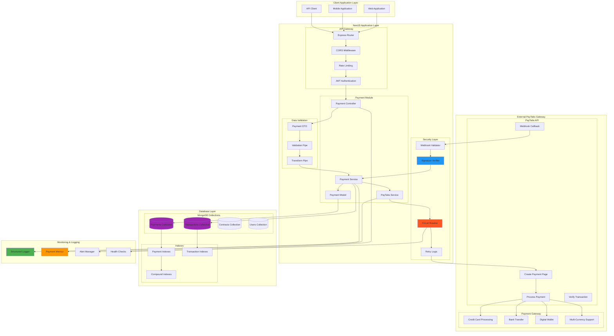
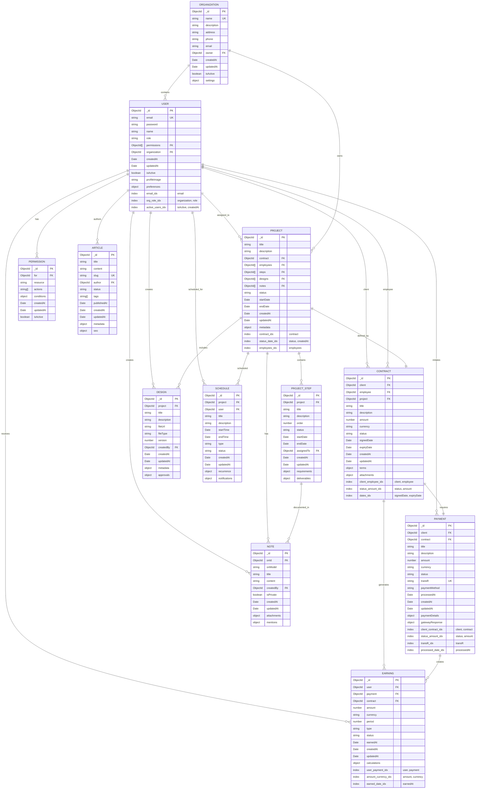

# Deep-Level Architecture Diagrams

## PayTabs Integration Deep Architecture



## Mongoose Aggregation Deep Architecture

```mermaid
graph TB
    subgraph "Application Services Layer"
        subgraph "Contract Service"
            ContractController[Contract Controller]
            ContractService[Contract Service]
            ContractAggregation[Contract Aggregation]
        end
        
        subgraph "Project Service"
            ProjectController[Project Controller]
            ProjectService[Project Service]
            ProjectAggregation[Project Aggregation]
        end
        
        subgraph "User Service"
            UserController[User Controller]
            UserService[User Service]
            UserAggregation[User Aggregation]
        end
        
        subgraph "Earnings Service"
            EarningsController[Earnings Controller]
            EarningsService[Earnings Service]
            EarningsAggregation[Earnings Aggregation]
        end
    end
    
    subgraph "Aggregation Pipeline Layer"
        subgraph "Pipeline Builders"
            ContractPipeline[Contract-Employee Pipeline]
            ProjectPipeline[Project-User Pipeline]
            EarningsPipeline[Earnings Calculation Pipeline]
            PermissionPipeline[Permission Aggregation Pipeline]
        end
        
        subgraph "Pipeline Optimizers"
            IndexOptimizer[Index Optimizer]
            QueryPlanner[Query Planner]
            CacheManager[Cache Manager]
            ResultProcessor[Result Processor]
        end
        
        subgraph "Performance Monitors"
            QueryProfiler[Query Profiler]
            PerformanceTracker[Performance Tracker]
            SlowQueryDetector[Slow Query Detector]
            MetricsCollector[Metrics Collector]
        end
    end
    
    subgraph "MongoDB Cluster Architecture"
        subgraph "Primary Node"
            PrimaryMongoDB[(Primary MongoDB)]
            PrimaryIndexes[Primary Indexes]
            WriteOperations[Write Operations]
        end
        
        subgraph "Read Replicas"
            ReadReplica1[(Read Replica 1)]
            ReadReplica2[(Read Replica 2)]
            ReplicaIndexes[Replica Indexes]
            ReadOperations[Read Operations]
        end
        
        subgraph "Aggregation Optimization"
            CompoundIndexes[Compound Indexes]
            MaterializedViews[Materialized Views]
            ShardingStrategy[Sharding Strategy]
            PartitionStrategy[Partition Strategy]
        end
    end
    
    subgraph "Caching Architecture"
        subgraph "Redis Cache Cluster"
            RedisMain[(Redis Main)]
            RedisReplica[(Redis Replica)]
            CachePartitioning[Cache Partitioning]
        end
        
        subgraph "Cache Strategies"
            QueryCache[Query Result Cache]
            AggregationCache[Aggregation Cache]
            SessionCache[Session Cache]
            TTLManager[TTL Manager]
        end
        
        subgraph "Cache Invalidation"
            InvalidationTriggers[Invalidation Triggers]
            CacheWarmup[Cache Warmup]
            CacheEviction[Cache Eviction]
        end
    end
    
    %% Service to Pipeline Connections
    ContractService --> ContractAggregation
    ProjectService --> ProjectAggregation
    UserService --> UserAggregation
    EarningsService --> EarningsAggregation
    
    ContractAggregation --> ContractPipeline
    ProjectAggregation --> ProjectPipeline
    UserAggregation --> PermissionPipeline
    EarningsAggregation --> EarningsPipeline
    
    %% Pipeline to Optimizer Connections
    ContractPipeline --> IndexOptimizer
    ProjectPipeline --> QueryPlanner
    EarningsPipeline --> CacheManager
    PermissionPipeline --> ResultProcessor
    
    %% Optimizer to Database Connections
    IndexOptimizer --> ReadReplica1
    QueryPlanner --> ReadReplica2
    CacheManager --> QueryCache
    ResultProcessor --> AggregationCache
    
    %% Write Operations
    ContractService --> WriteOperations
    ProjectService --> WriteOperations
    UserService --> WriteOperations
    EarningsService --> WriteOperations
    
    WriteOperations --> PrimaryMongoDB
    PrimaryMongoDB --> PrimaryIndexes
    PrimaryIndexes --> CompoundIndexes
    
    %% Read Operations
    ReadOperations --> ReadReplica1
    ReadOperations --> ReadReplica2
    ReadReplica1 --> ReplicaIndexes
    ReadReplica2 --> ReplicaIndexes
    
    %% Cache Operations
    QueryCache --> RedisMain
    AggregationCache --> RedisReplica
    RedisMain --> CachePartitioning
    
    %% Performance Monitoring
    ContractPipeline --> QueryProfiler
    ProjectPipeline --> PerformanceTracker
    EarningsPipeline --> SlowQueryDetector
    PermissionPipeline --> MetricsCollector
    
    %% Cache Management
    CacheManager --> InvalidationTriggers
    TTLManager --> CacheWarmup
    CacheEviction --> InvalidationTriggers
    
    style ContractPipeline fill:#e3f2fd
    style ProjectPipeline fill:#e3f2fd
    style EarningsPipeline fill:#e3f2fd
    style PermissionPipeline fill:#e3f2fd
    style QueryCache fill:#fff3e0
    style AggregationCache fill:#fff3e0
    style CompoundIndexes fill:#e8f5e8
    style MaterializedViews fill:#e8f5e8
    style QueryProfiler fill:#fce4ec
    style PerformanceTracker fill:#fce4ec
```



## System Integration Deep Architecture

```mermaid
graph TB
    subgraph "Frontend Layer"
        subgraph "Web Application"
            ReactApp[React Application]
            StateManagement[Redux/Context]
            APIClient[Axios Client]
            AuthProvider[Auth Provider]
        end
        
        subgraph "Mobile Application"
            ReactNative[React Native]
            NativeModules[Native Modules]
            AsyncStorage[Async Storage]
            PushNotifications[Push Notifications]
        end
    end
    
    subgraph "API Gateway Layer"
        subgraph "Load Balancer"
            NginxLB[Nginx Load Balancer]
            HealthChecks[Health Checks]
            SSLTermination[SSL Termination]
            RequestRouting[Request Routing]
        end
        
        subgraph "API Gateway"
            RateLimiting[Rate Limiting]
            RequestValidation[Request Validation]
            ResponseTransformation[Response Transformation]
            APIVersioning[API Versioning]
        end
    end
    
    subgraph "NestJS Application Cluster"
        subgraph "Application Instance 1"
            NestApp1[NestJS App 1]
            Controllers1[Controllers]
            Services1[Services]
            Guards1[Guards & Middleware]
        end
        
        subgraph "Application Instance 2"
            NestApp2[NestJS App 2]
            Controllers2[Controllers]
            Services2[Services]
            Guards2[Guards & Middleware]
        end
        
        subgraph "Application Instance 3"
            NestApp3[NestJS App 3]
            Controllers3[Controllers]
            Services3[Services]
            Guards3[Guards & Middleware]
        end
    end
    
    subgraph "Business Logic Layer"
        subgraph "Core Services"
            UserManagement[User Management]
            ProjectManagement[Project Management]
            ContractManagement[Contract Management]
            PaymentProcessing[Payment Processing]
        end
        
        subgraph "Integration Services"
            PayTabsIntegration[PayTabs Integration]
            EmailService[Email Service]
            FileStorageService[File Storage Service]
            NotificationService[Notification Service]
        end
        
        subgraph "Data Access Layer"
            MongooseODM[Mongoose ODM]
            AggregationEngine[Aggregation Engine]
            QueryBuilder[Query Builder]
            TransactionManager[Transaction Manager]
        end
    end
    
    subgraph "Database Cluster"
        subgraph "MongoDB Replica Set"
            MongodbPrimary[(MongoDB Primary)]
            MongodbSecondary1[(MongoDB Secondary 1)]
            MongodbSecondary2[(MongoDB Secondary 2)]
            MongodbArbiter[MongoDB Arbiter]
        end
        
        subgraph "Database Optimization"
            IndexManagement[Index Management]
            ShardingConfig[Sharding Configuration]
            BackupStrategy[Backup Strategy]
            MonitoringTools[Monitoring Tools]
        end
    end
    
    subgraph "Caching & Session Layer"
        subgraph "Redis Cluster"
            RedisMaster[(Redis Master)]
            RedisSlave1[(Redis Slave 1)]
            RedisSlave2[(Redis Slave 2)]
            RedisCluster[Redis Cluster Config]
        end
        
        subgraph "Cache Management"
            SessionStore[Session Store]
            QueryResultCache[Query Result Cache]
            ApplicationCache[Application Cache]
            CacheInvalidation[Cache Invalidation]
        end
    end
    
    subgraph "External Services"
        subgraph "Payment Gateway"
            PayTabsAPI[PayTabs API]
            PaymentWebhooks[Payment Webhooks]
            TransactionVerification[Transaction Verification]
        end
        
        subgraph "Third-Party Services"
            EmailProvider[Email Provider]
            FileStorage[File Storage (AWS S3)]
            SMSProvider[SMS Provider]
            PushService[Push Notification Service]
        end
    end
    
    subgraph "Monitoring & Observability"
        subgraph "Logging"
            LogAggregation[Log Aggregation]
            StructuredLogging[Structured Logging]
            LogAnalysis[Log Analysis]
        end
        
        subgraph "Metrics & Monitoring"
            PrometheusMetrics[Prometheus Metrics]
            GrafanaDashboards[Grafana Dashboards]
            AlertManager[Alert Manager]
            UptimeMonitoring[Uptime Monitoring]
        end
        
        subgraph "Performance Monitoring"
            APMTools[APM Tools]
            DatabaseMonitoring[Database Monitoring]
            CacheMonitoring[Cache Monitoring]
            NetworkMonitoring[Network Monitoring]
        end
    end
    
    %% Frontend to API Gateway
    ReactApp --> NginxLB
    ReactNative --> NginxLB
    APIClient --> SSLTermination
    
    %% API Gateway to Applications
    NginxLB --> RequestRouting
    RequestRouting --> RateLimiting
    RateLimiting --> NestApp1
    RateLimiting --> NestApp2
    RateLimiting --> NestApp3
    
    %% Application to Business Logic
    Services1 --> UserManagement
    Services2 --> ProjectManagement
    Services3 --> ContractManagement
    Services1 --> PaymentProcessing
    
    %% Business Logic to Data Access
    UserManagement --> MongooseODM
    ProjectManagement --> AggregationEngine
    ContractManagement --> QueryBuilder
    PaymentProcessing --> TransactionManager
    
    %% Data Access to Database
    MongooseODM --> MongodbPrimary
    AggregationEngine --> MongodbSecondary1
    QueryBuilder --> MongodbSecondary2
    TransactionManager --> MongodbPrimary
    
    %% Caching Layer
    Services1 --> SessionStore
    Services2 --> QueryResultCache
    Services3 --> ApplicationCache
    SessionStore --> RedisMaster
    QueryResultCache --> RedisSlave1
    ApplicationCache --> RedisSlave2
    
    %% External Integrations
    PaymentProcessing --> PayTabsAPI
    PayTabsAPI --> PaymentWebhooks
    EmailService --> EmailProvider
    FileStorageService --> FileStorage
    NotificationService --> PushService
    
    %% Monitoring Connections
    NestApp1 --> StructuredLogging
    NestApp2 --> PrometheusMetrics
    NestApp3 --> APMTools
    MongodbPrimary --> DatabaseMonitoring
    RedisMaster --> CacheMonitoring
    
    style NestApp1 fill:#e91e63
    style NestApp2 fill:#e91e63
    style NestApp3 fill:#e91e63
    style MongodbPrimary fill:#4caf50
    style MongodbSecondary1 fill:#81c784
    style MongodbSecondary2 fill:#81c784
    style RedisMaster fill:#f44336
    style RedisSlave1 fill:#ef5350
    style RedisSlave2 fill:#ef5350
    style PayTabsAPI fill:#ff9800
    style PrometheusMetrics fill:#ff5722
    style GrafanaDashboards fill:#2196f3
```

## Database Schema Deep Architecture



## Security Architecture Deep Dive

```mermaid
graph TB
    subgraph "Security Perimeter"
        subgraph "Network Security"
            WAF[Web Application Firewall]
            DDoSProtection[DDoS Protection]
            IPWhitelisting[IP Whitelisting]
            GeoBlocking[Geo-blocking]
        end
        
        subgraph "SSL/TLS Layer"
            SSLTermination[SSL Termination]
            CertificateManagement[Certificate Management]
            HSTSHeaders[HSTS Headers]
            TLSVersionControl[TLS Version Control]
        end
    end
    
    subgraph "Application Security"
        subgraph "Authentication Layer"
            JWTAuthentication[JWT Authentication]
            PassportStrategies[Passport Strategies]
            LocalStrategy[Local Strategy]
            JWTStrategy[JWT Strategy]
            RefreshTokens[Refresh Tokens]
        end
        
        subgraph "Authorization Layer"
            RoleBasedAccess[Role-Based Access Control]
            PermissionGuards[Permission Guards]
            ResourceGuards[Resource Guards]
            MethodGuards[Method Guards]
        end
        
        subgraph "Input Validation"
            ValidationPipes[Validation Pipes]
            DTOValidation[DTO Validation]
            SanitizationFilters[Sanitization Filters]
            XSSProtection[XSS Protection]
            SQLInjectionPrevention[SQL Injection Prevention]
        end
        
        subgraph "Session Management"
            SessionStore[Secure Session Store]
            SessionTimeout[Session Timeout]
            ConcurrentSessions[Concurrent Session Control]
            SessionInvalidation[Session Invalidation]
        end
    end
    
    subgraph "API Security"
        subgraph "Rate Limiting"
            GlobalRateLimit[Global Rate Limiting]
            UserRateLimit[Per-User Rate Limiting]
            EndpointRateLimit[Per-Endpoint Rate Limiting]
            BurstProtection[Burst Protection]
        end
        
        subgraph "Request Security"
            RequestSigning[Request Signing]
            TimestampValidation[Timestamp Validation]
            NonceValidation[Nonce Validation]
            PayloadEncryption[Payload Encryption]
        end
        
        subgraph "Response Security"
            ResponseSigning[Response Signing]
            DataMasking[Sensitive Data Masking]
            ResponseFiltering[Response Filtering]
            HeaderSecurity[Security Headers]
        end
    end
    
    subgraph "Data Security"
        subgraph "Encryption"
            DataAtRest[Data at Rest Encryption]
            DataInTransit[Data in Transit Encryption]
            FieldLevelEncryption[Field-Level Encryption]
            KeyManagement[Key Management]
        end
        
        subgraph "Database Security"
            DatabaseAuthentication[Database Authentication]
            ConnectionEncryption[Connection Encryption]
            QueryParameterization[Query Parameterization]
            DatabaseAuditing[Database Auditing]
        end
        
        subgraph "Backup Security"
            EncryptedBackups[Encrypted Backups]
            BackupAccessControl[Backup Access Control]
            BackupIntegrity[Backup Integrity Checks]
            SecureStorage[Secure Backup Storage]
        end
    end
    
    subgraph "Integration Security"
        subgraph "PayTabs Security"
            WebhookSigning[Webhook Signature Verification]
            APIKeyManagement[API Key Management]
            PaymentTokenization[Payment Tokenization]
            PCICompliance[PCI Compliance]
        end
        
        subgraph "Third-Party Security"
            APIKeyRotation[API Key Rotation]
            ServiceAuthentication[Service Authentication]
            TrustedCertificates[Trusted Certificates]
            VendorAssessment[Vendor Security Assessment]
        end
    end
    
    subgraph "Monitoring & Compliance"
        subgraph "Security Monitoring"
            SIEM[Security Information & Event Management]
            ThreatDetection[Threat Detection]
            AnomalyDetection[Anomaly Detection]
            SecurityAlerts[Security Alerts]
        end
        
        subgraph "Audit & Compliance"
            AuditLogging[Comprehensive Audit Logging]
            ComplianceReporting[Compliance Reporting]
            SecurityAssessments[Security Assessments]
            VulnerabilityScanning[Vulnerability Scanning]
        end
        
        subgraph "Incident Response"
            IncidentDetection[Incident Detection]
            ResponseProcedures[Response Procedures]
            ForensicAnalysis[Forensic Analysis]
            RecoveryPlanning[Recovery Planning]
        end
    end
    
    %% Security Flow Connections
    WAF --> DDoSProtection
    DDoSProtection --> SSLTermination
    SSLTermination --> JWTAuthentication
    JWTAuthentication --> RoleBasedAccess
    RoleBasedAccess --> ValidationPipes
    ValidationPipes --> GlobalRateLimit
    GlobalRateLimit --> RequestSigning
    RequestSigning --> DataAtRest
    DataAtRest --> WebhookSigning
    WebhookSigning --> SIEM
    SIEM --> AuditLogging
    AuditLogging --> IncidentDetection
    
    %% Cross-cutting Security Concerns
    JWTAuthentication --> SessionStore
    RoleBasedAccess --> PermissionGuards
    ValidationPipes --> XSSProtection
    DataAtRest --> KeyManagement
    WebhookSigning --> PCICompliance
    SIEM --> ThreatDetection
    
    style WAF fill:#f44336
    style JWTAuthentication fill:#4caf50
    style RoleBasedAccess fill:#4caf50
    style ValidationPipes fill:#2196f3
    style DataAtRest fill:#9c27b0
    style WebhookSigning fill:#ff9800
    style SIEM fill:#795548
    style AuditLogging fill:#607d8b
```



This deep-level architecture documentation provides comprehensive technical diagrams showing the detailed implementation of PayTabs integration, Mongoose aggregation patterns, system integration architecture, database schema relationships, and security architecture. These diagrams serve as detailed blueprints for development teams and technical stakeholders to understand the system's deep technical implementation.

