# 🔐 **SECURITY ARCHITECTURE DIAGRAMS**

## 🛡️ **COMPREHENSIVE SECURITY ARCHITECTURE**

> **Status: ✅ SECURITY-HARDENED** - Multi-layer security architecture with authentication, authorization, encryption, and threat protection!

---

## 🔒 **AUTHENTICATION & AUTHORIZATION FLOW**

```mermaid
sequenceDiagram
    participant Client as 🖥️ Client Application
    participant Gateway as 🚪 API Gateway
    participant Auth as 🛡️ Auth Service
    participant JWT as 🔑 JWT Service
    participant DB as 🗄️ User Database
    participant Cache as ⚡ Redis Cache
    participant App as 🚀 NestCMS App

    %% Authentication Flow
    Client->>Gateway: 1. Login Request (email, password)
    Gateway->>Auth: 2. Validate Credentials
    Auth->>DB: 3. Query User Data
    DB-->>Auth: 4. User Profile & Permissions
    Auth->>JWT: 5. Generate JWT Token
    JWT-->>Auth: 6. Signed JWT Token
    Auth->>Cache: 7. Store Session Data
    Auth-->>Gateway: 8. Authentication Response
    Gateway-->>Client: 9. JWT Token + User Info

    %% Authorization Flow
    Client->>Gateway: 10. API Request + JWT Token
    Gateway->>Auth: 11. Validate JWT Token
    Auth->>Cache: 12. Check Session Status
    Cache-->>Auth: 13. Session Valid
    Auth->>DB: 14. Get User Permissions
    DB-->>Auth: 15. Permission Set
    Auth-->>Gateway: 16. Authorization Result
    
    alt Authorized
        Gateway->>App: 17. Forward Request + User Context
        App-->>Gateway: 18. API Response
        Gateway-->>Client: 19. Success Response
    else Unauthorized
        Gateway-->>Client: 20. 403 Forbidden
    end
```



---

## 🛡️ **MULTI-LAYER SECURITY ARCHITECTURE**

```mermaid
graph TB
    %% Styling
    classDef clientClass fill:#e1f5fe,stroke:#01579b,stroke-width:3px,color:#000
    classDef gatewayClass fill:#ffebee,stroke:#c62828,stroke-width:3px,color:#000
    classDef authClass fill:#f3e5f5,stroke:#7b1fa2,stroke-width:3px,color:#000
    classDef appClass fill:#e8f5e8,stroke:#2e7d32,stroke-width:3px,color:#000
    classDef dataClass fill:#fff3e0,stroke:#ef6c00,stroke-width:3px,color:#000
    classDef monitorClass fill:#f1f8e9,stroke:#558b2f,stroke-width:3px,color:#000

    %% Client Layer
    subgraph "🌐 CLIENT SECURITY LAYER"
        CLIENT[🖥️ Client Applications<br/>HTTPS Only<br/>Certificate Pinning<br/>CSRF Protection<br/>XSS Prevention]
        MOBILE[📱 Mobile Apps<br/>App Store Security<br/>Certificate Validation<br/>Biometric Auth<br/>Root Detection]
    end

    %% Edge Security
    subgraph "🚪 EDGE SECURITY LAYER"
        CDN[🚀 CDN + WAF<br/>DDoS Protection<br/>Bot Detection<br/>Geo-blocking<br/>Rate Limiting]
        LOAD_BALANCER[⚖️ Load Balancer<br/>SSL Termination<br/>Health Checks<br/>IP Filtering<br/>Request Validation]
    end

    %% Gateway Security
    subgraph "🛡️ API GATEWAY SECURITY"
        API_GATEWAY[🚪 API Gateway<br/>Request Validation<br/>Rate Limiting<br/>API Key Management<br/>Request/Response Filtering]
        
        subgraph "🔐 AUTHENTICATION LAYER"
            JWT_AUTH[🔑 JWT Authentication<br/>Token Validation<br/>Signature Verification<br/>Expiry Checking<br/>Refresh Token Rotation]
            OAUTH[🔒 OAuth 2.0 / OIDC<br/>Third-party Auth<br/>Social Login<br/>Scope Management<br/>Token Introspection]
            MFA[📱 Multi-Factor Auth<br/>TOTP/SMS/Email<br/>Biometric Verification<br/>Hardware Tokens<br/>Risk-based Auth]
        end
        
        subgraph "🛡️ AUTHORIZATION LAYER"
            RBAC[👥 Role-Based Access Control<br/>User Roles<br/>Permission Sets<br/>Resource Access<br/>Hierarchical Permissions]
            ABAC[🎯 Attribute-Based Access Control<br/>Context-aware Decisions<br/>Dynamic Policies<br/>Fine-grained Control<br/>Policy Engine]
        end
    end

    %% Application Security
    subgraph "🏢 APPLICATION SECURITY LAYER"
        APP_FIREWALL[🔥 Application Firewall<br/>Input Validation<br/>SQL Injection Prevention<br/>Command Injection Protection<br/>File Upload Security]
        
        subgraph "🔒 DATA PROTECTION"
            ENCRYPTION[🔐 Data Encryption<br/>AES-256 Encryption<br/>Field-level Encryption<br/>Key Management<br/>Crypto Agility]
            HASHING[#️⃣ Password Hashing<br/>bcrypt/Argon2<br/>Salt Generation<br/>Pepper Addition<br/>Hash Verification]
            MASKING[🎭 Data Masking<br/>PII Protection<br/>Log Sanitization<br/>Response Filtering<br/>Sensitive Data Redaction]
        end
        
        subgraph "🛡️ WEBHOOK SECURITY"
            WEBHOOK_AUTH[🔐 Webhook Authentication<br/>HMAC Signature Verification<br/>Timestamp Validation<br/>IP Whitelisting<br/>Replay Attack Prevention]
            SIGNATURE_VERIFY[✍️ Signature Verification<br/>SHA-256/SHA-512<br/>Constant-time Comparison<br/>Multi-algorithm Support<br/>Key Rotation]
        end
    end

    %% Data Security
    subgraph "🗃️ DATA SECURITY LAYER"
        DB_ENCRYPTION[🔒 Database Encryption<br/>Encryption at Rest<br/>TDE (Transparent Data Encryption)<br/>Column-level Encryption<br/>Key Rotation]
        
        subgraph "🔐 ACCESS CONTROL"
            DB_AUTH[🛡️ Database Authentication<br/>Strong Passwords<br/>Certificate-based Auth<br/>Connection Encryption<br/>User Management]
            DB_AUTHZ[👥 Database Authorization<br/>User Privileges<br/>Schema Permissions<br/>Row-level Security<br/>Audit Logging]
        end
        
        BACKUP_SECURITY[💾 Backup Security<br/>Encrypted Backups<br/>Secure Storage<br/>Access Controls<br/>Retention Policies]
    end

    %% Monitoring & Compliance
    subgraph "📊 SECURITY MONITORING & COMPLIANCE"
        SIEM[🔍 SIEM System<br/>Security Event Correlation<br/>Threat Detection<br/>Incident Response<br/>Forensic Analysis]
        
        subgraph "📈 SECURITY METRICS"
            VULNERABILITY_SCAN[🔍 Vulnerability Scanning<br/>Automated Scans<br/>Dependency Checking<br/>Code Analysis<br/>Penetration Testing]
            COMPLIANCE[📋 Compliance Monitoring<br/>GDPR Compliance<br/>PCI DSS<br/>SOC 2<br/>ISO 27001]
            AUDIT_LOG[📝 Security Audit Logging<br/>Access Logs<br/>Change Logs<br/>Security Events<br/>Compliance Reports]
        end
        
        THREAT_INTEL[🎯 Threat Intelligence<br/>IOC Monitoring<br/>Threat Feeds<br/>Behavioral Analysis<br/>Anomaly Detection]
    end

    %% Connections
    CLIENT --> CDN
    MOBILE --> CDN
    CDN --> LOAD_BALANCER
    LOAD_BALANCER --> API_GATEWAY
    
    API_GATEWAY --> JWT_AUTH
    API_GATEWAY --> OAUTH
    API_GATEWAY --> MFA
    
    JWT_AUTH --> RBAC
    OAUTH --> RBAC
    MFA --> ABAC
    
    RBAC --> APP_FIREWALL
    ABAC --> APP_FIREWALL
    
    APP_FIREWALL --> ENCRYPTION
    APP_FIREWALL --> HASHING
    APP_FIREWALL --> MASKING
    APP_FIREWALL --> WEBHOOK_AUTH
    
    WEBHOOK_AUTH --> SIGNATURE_VERIFY
    
    ENCRYPTION --> DB_ENCRYPTION
    HASHING --> DB_AUTH
    
    DB_ENCRYPTION --> DB_AUTHZ
    DB_AUTH --> BACKUP_SECURITY
    
    APP_FIREWALL --> SIEM
    DB_AUTHZ --> AUDIT_LOG
    BACKUP_SECURITY --> COMPLIANCE
    
    SIEM --> VULNERABILITY_SCAN
    SIEM --> THREAT_INTEL
    AUDIT_LOG --> COMPLIANCE

    %% Apply styles
    class CLIENT,MOBILE clientClass
    class CDN,LOAD_BALANCER,API_GATEWAY gatewayClass
    class JWT_AUTH,OAUTH,MFA,RBAC,ABAC authClass
    class APP_FIREWALL,ENCRYPTION,HASHING,MASKING,WEBHOOK_AUTH,SIGNATURE_VERIFY appClass
    class DB_ENCRYPTION,DB_AUTH,DB_AUTHZ,BACKUP_SECURITY dataClass
    class SIEM,VULNERABILITY_SCAN,COMPLIANCE,AUDIT_LOG,THREAT_INTEL monitorClass
```

---

## 🔐 **PAYTABS WEBHOOK SECURITY ARCHITECTURE**

```mermaid
graph TB
    %% Styling
    classDef externalClass fill:#e1f5fe,stroke:#01579b,stroke-width:3px,color:#000
    classDef gatewayClass fill:#ffebee,stroke:#c62828,stroke-width:3px,color:#000
    classDef securityClass fill:#f3e5f5,stroke:#7b1fa2,stroke-width:3px,color:#000
    classDef validationClass fill:#fff3e0,stroke:#ef6c00,stroke-width:3px,color:#000
    classDef processingClass fill:#e8f5e8,stroke:#2e7d32,stroke-width:3px,color:#000

    %% External Source
    PAYTABS[🏦 PayTabs Gateway<br/>Payment Webhook<br/>Transaction Events<br/>Status Updates<br/>Signed Payload]

    %% Security Gateway
    subgraph "🛡️ WEBHOOK SECURITY GATEWAY"
        HTTPS_CHECK[🔒 HTTPS Validation<br/>TLS 1.2+ Required<br/>Certificate Validation<br/>Protocol Enforcement<br/>Secure Headers]
        
        IP_FILTER[🌐 IP Filtering<br/>PayTabs IP Whitelist<br/>Geo-location Check<br/>VPN Detection<br/>Proxy Filtering]
        
        RATE_LIMITER[⏱️ Rate Limiting<br/>Request Throttling<br/>Burst Protection<br/>IP-based Limits<br/>Sliding Window]
    end

    %% Multi-Layer Validation
    subgraph "🔐 MULTI-LAYER VALIDATION"
        subgraph "✍️ SIGNATURE VALIDATION"
            SIGNATURE_EXTRACT[📝 Signature Extraction<br/>Header Parsing<br/>Algorithm Detection<br/>Format Validation<br/>Encoding Check]
            
            HMAC_VERIFY[🔐 HMAC Verification<br/>SHA-256/SHA-512<br/>Secret Key Validation<br/>Constant-time Comparison<br/>Timing Attack Prevention]
            
            SIGNATURE_RESULT{✅ Signature Valid?}
        end
        
        subgraph "⏰ TIMESTAMP VALIDATION"
            TIMESTAMP_EXTRACT[🕐 Timestamp Extraction<br/>Header Parsing<br/>Format Validation<br/>Unix Timestamp<br/>Timezone Handling]
            
            TIMESTAMP_CHECK[⏱️ Timestamp Verification<br/>Current Time Comparison<br/>Tolerance Window (5min)<br/>Future Time Prevention<br/>Clock Skew Handling]
            
            TIMESTAMP_RESULT{✅ Timestamp Valid?}
        end
        
        subgraph "🔍 PAYLOAD VALIDATION"
            PAYLOAD_SIZE[📏 Size Validation<br/>Maximum Size Check (1MB)<br/>Minimum Size Check<br/>Content-Length Validation<br/>Memory Protection]
            
            PAYLOAD_STRUCTURE[🏗️ Structure Validation<br/>JSON Schema Validation<br/>Required Fields Check<br/>Data Type Validation<br/>Format Verification]
            
            PAYLOAD_CONTENT[📋 Content Validation<br/>Business Logic Check<br/>Transaction ID Format<br/>Amount Validation<br/>Currency Check]
            
            PAYLOAD_RESULT{✅ Payload Valid?}
        end
        
        subgraph "🚫 REPLAY PROTECTION"
            FINGERPRINT_GEN[🔍 Request Fingerprinting<br/>Payload Hash<br/>Timestamp Inclusion<br/>Signature Inclusion<br/>Unique Identifier]
            
            DUPLICATE_CHECK[🔄 Duplicate Detection<br/>Fingerprint Lookup<br/>Memory Cache Check<br/>Time-based Cleanup<br/>Storage Optimization]
            
            REPLAY_RESULT{✅ Not Duplicate?}
        end
    end

    %% Security Monitoring
    subgraph "📊 SECURITY MONITORING"
        SECURITY_METRICS[📈 Security Metrics<br/>Validation Success Rate<br/>Signature Failures<br/>Replay Attempts<br/>IP Violations]
        
        THREAT_DETECTION[🎯 Threat Detection<br/>Anomaly Detection<br/>Pattern Recognition<br/>Behavioral Analysis<br/>Risk Scoring]
        
        INCIDENT_RESPONSE[🚨 Incident Response<br/>Alert Generation<br/>Automatic Blocking<br/>Escalation Rules<br/>Forensic Logging]
    end

    %% Processing Layer
    subgraph "⚙️ WEBHOOK PROCESSING"
        WEBHOOK_PROCESSOR[🔧 Webhook Processor<br/>Business Logic<br/>Transaction Updates<br/>Status Changes<br/>Event Emission]
        
        AUDIT_LOGGER[📝 Audit Logger<br/>Security Events<br/>Validation Results<br/>Processing Status<br/>Error Details]
        
        RESPONSE_GEN[📤 Response Generator<br/>Success Response<br/>Error Response<br/>Status Codes<br/>Security Headers]
    end

    %% Flow Connections
    PAYTABS --> HTTPS_CHECK
    HTTPS_CHECK -->|✅ HTTPS| IP_FILTER
    HTTPS_CHECK -->|❌ HTTP| INCIDENT_RESPONSE
    
    IP_FILTER -->|✅ Whitelisted| RATE_LIMITER
    IP_FILTER -->|❌ Blocked| INCIDENT_RESPONSE
    
    RATE_LIMITER -->|✅ Within Limits| SIGNATURE_EXTRACT
    RATE_LIMITER -->|❌ Rate Limited| INCIDENT_RESPONSE
    
    SIGNATURE_EXTRACT --> HMAC_VERIFY
    HMAC_VERIFY --> SIGNATURE_RESULT
    SIGNATURE_RESULT -->|✅ Valid| TIMESTAMP_EXTRACT
    SIGNATURE_RESULT -->|❌ Invalid| INCIDENT_RESPONSE
    
    TIMESTAMP_EXTRACT --> TIMESTAMP_CHECK
    TIMESTAMP_CHECK --> TIMESTAMP_RESULT
    TIMESTAMP_RESULT -->|✅ Valid| PAYLOAD_SIZE
    TIMESTAMP_RESULT -->|❌ Invalid| INCIDENT_RESPONSE
    
    PAYLOAD_SIZE --> PAYLOAD_STRUCTURE
    PAYLOAD_STRUCTURE --> PAYLOAD_CONTENT
    PAYLOAD_CONTENT --> PAYLOAD_RESULT
    PAYLOAD_RESULT -->|✅ Valid| FINGERPRINT_GEN
    PAYLOAD_RESULT -->|❌ Invalid| INCIDENT_RESPONSE
    
    FINGERPRINT_GEN --> DUPLICATE_CHECK
    DUPLICATE_CHECK --> REPLAY_RESULT
    REPLAY_RESULT -->|✅ Not Duplicate| WEBHOOK_PROCESSOR
    REPLAY_RESULT -->|❌ Duplicate| INCIDENT_RESPONSE
    
    WEBHOOK_PROCESSOR --> AUDIT_LOGGER
    WEBHOOK_PROCESSOR --> RESPONSE_GEN
    
    %% Monitoring Connections
    SIGNATURE_RESULT --> SECURITY_METRICS
    TIMESTAMP_RESULT --> SECURITY_METRICS
    PAYLOAD_RESULT --> SECURITY_METRICS
    REPLAY_RESULT --> SECURITY_METRICS
    
    SECURITY_METRICS --> THREAT_DETECTION
    THREAT_DETECTION --> INCIDENT_RESPONSE
    
    AUDIT_LOGGER --> SECURITY_METRICS

    %% Apply styles
    class PAYTABS externalClass
    class HTTPS_CHECK,IP_FILTER,RATE_LIMITER gatewayClass
    class SIGNATURE_EXTRACT,HMAC_VERIFY,TIMESTAMP_EXTRACT,TIMESTAMP_CHECK,FINGERPRINT_GEN,DUPLICATE_CHECK securityClass
    class PAYLOAD_SIZE,PAYLOAD_STRUCTURE,PAYLOAD_CONTENT validationClass
    class WEBHOOK_PROCESSOR,AUDIT_LOGGER,RESPONSE_GEN,SECURITY_METRICS,THREAT_DETECTION,INCIDENT_RESPONSE processingClass
```
