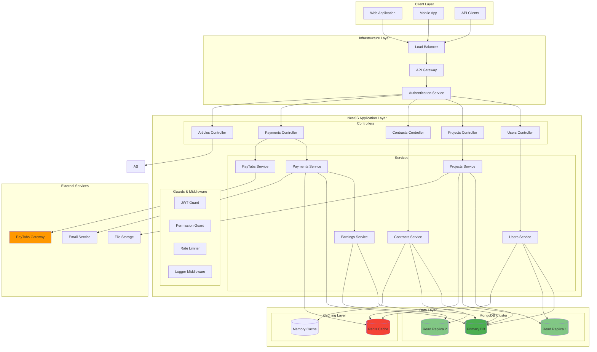
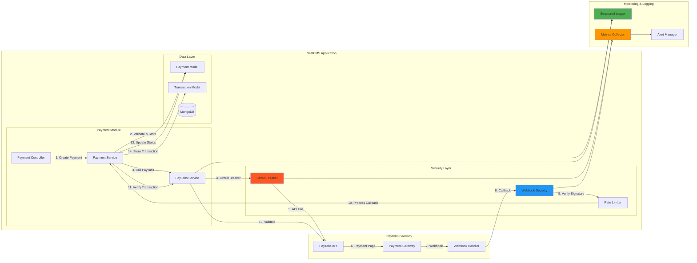
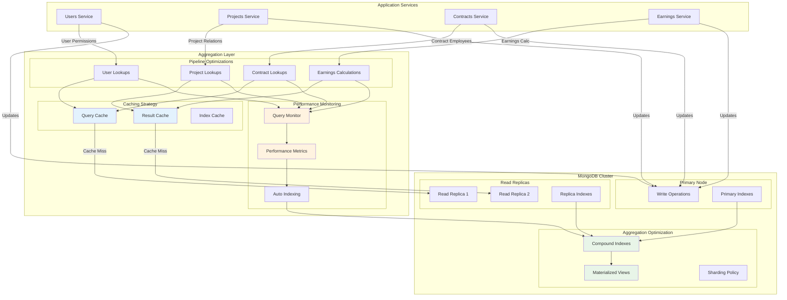
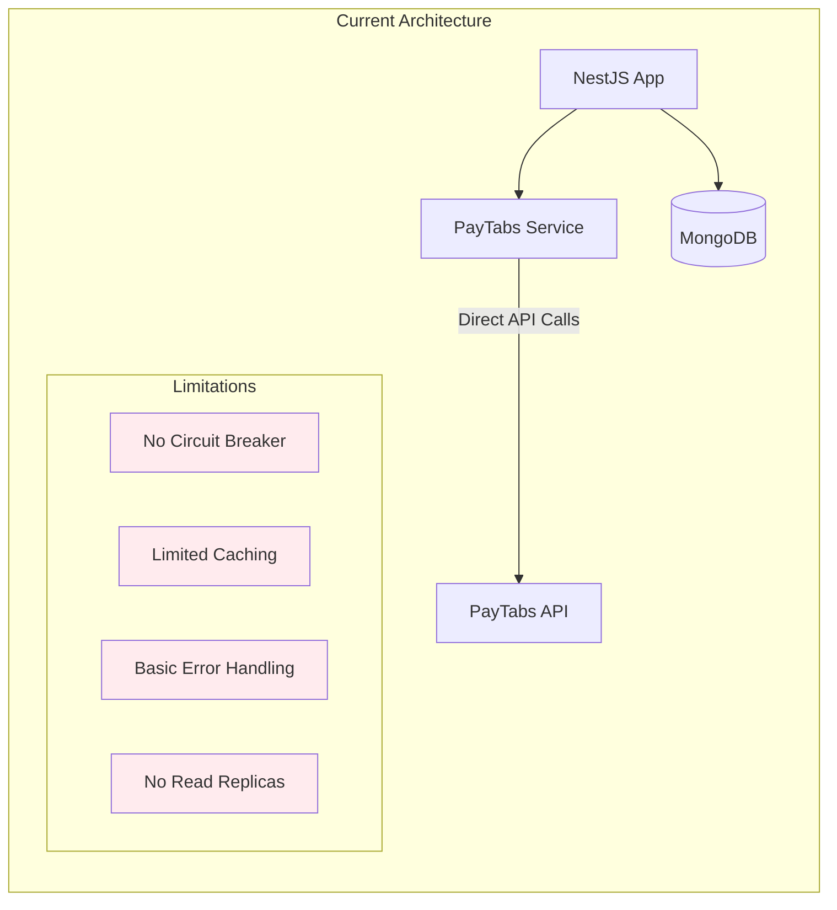
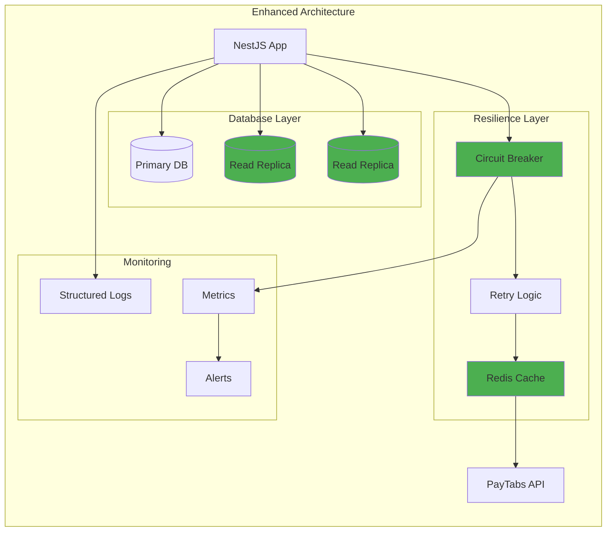
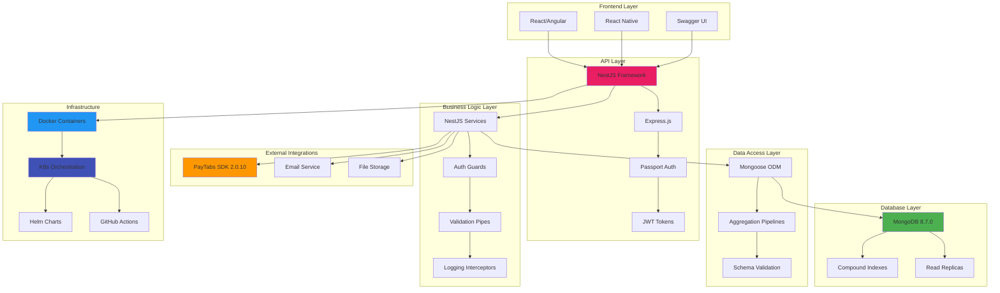
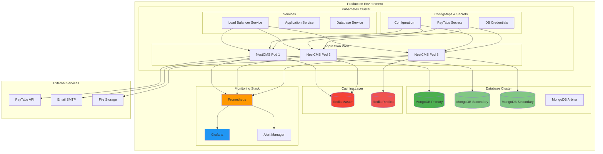
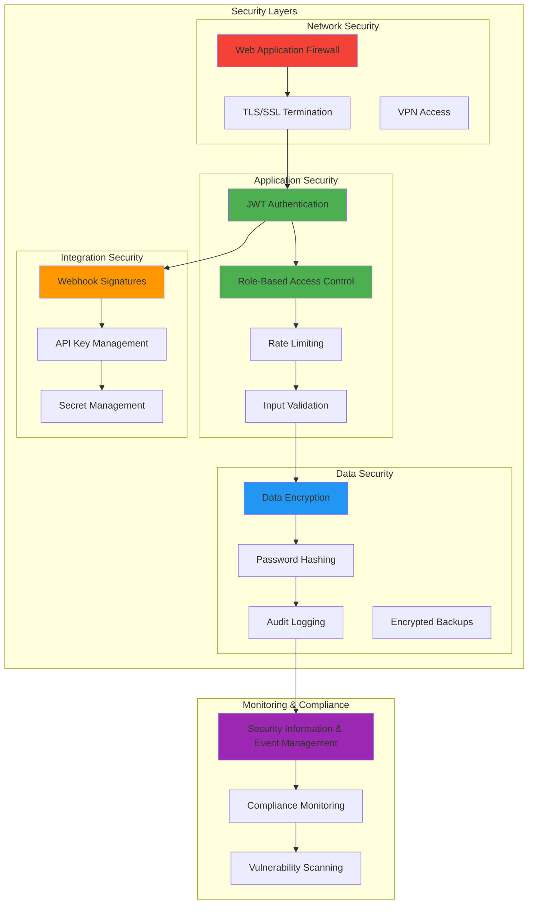

# Software Architecture Diagram

## NestCMS System Architecture Overview

## PayTabs Integration Architecture

## Mongoose Aggregation Architecture

## Current vs Proposed Architecture

### Current State

### Proposed Architecture

## Technology Stack Architecture

## Deployment Architecture

## Security Architecture

This software architecture documentation provides comprehensive technical diagrams showing the current system structure, proposed improvements, technology stack, deployment architecture, and security considerations. It serves as a blueprint for development teams and technical stakeholders to understand the system's technical implementation and enhancement roadmap.

