# ✅ IMPLEMENTED: Enhanced Deep-Level Technical Architecture

## 🚀 **PRODUCTION-READY** PayTabs Integration Deep Architecture with Resilience Patterns

> **Status: ✅ FULLY IMPLEMENTED** - All services, circuit breakers, caching, and monitoring are now production-ready!

```mermaid
graph TB
    subgraph "Client Application Layer"
        WebApp[Web Application]
        MobileApp[Mobile Application]
        APIClient[API Client]
    end
    
    subgraph "NestJS Application Layer"
        subgraph "API Gateway"
            Router[Express Router]
            CORS[CORS Middleware]
            RateLimit[Rate Limiting]
            Auth[JWT Authentication]
        end
        
        subgraph "Enhanced Payment Module"
            PayController[Payment Controller]
            PayService[Payment Service]
            EPayService[Enhanced Payment Service v2]
            PayTabService[PayTabs Service]
            EPayTabService[Enhanced PayTabs Service]
            PayModel[Payment Model]
        end
        
        subgraph "Security Layer"
            WebhookValidator[Webhook Validator]
            SignatureVerifier[HMAC Signature Verifier]
            CircuitBreaker[Circuit Breaker]
            RetryMechanism[Retry Logic with Exponential Backoff]
            TimestampValidator[Timestamp Validator]
            IPWhitelist[IP Whitelist Validator]
        end
        
        subgraph "Event-Driven Architecture"
            EventEmitter[Event Emitter]
            PaymentEvents[Payment Lifecycle Events]
            CircuitBreakerEvents[Circuit Breaker Events]
            WebhookEvents[Webhook Security Events]
            SystemHealthEvents[System Health Events]
        end
        
        subgraph "Data Validation & Transformation"
            PaymentDTO[Payment DTO]
            ValidationPipe[Validation Pipe]
            TransformPipe[Transform Pipe]
            SanitizationPipe[Sanitization Pipe]
        end
    end
    
    subgraph "External PayTabs Gateway"
        subgraph "PayTabs API"
            CreatePage[Create Payment Page]
            ProcessPayment[Process Payment]
            VerifyTransaction[Verify Transaction]
            WebhookEndpoint[Webhook Callback]
            RefundAPI[Refund API]
        end
        
        subgraph "Payment Gateway"
            CreditCard[Credit Card Processing]
            BankTransfer[Bank Transfer]
            DigitalWallet[Digital Wallet]
            MultiCurrency[Multi-Currency Support]
            FraudDetection[Fraud Detection]
        end
    end
    
    subgraph "Enhanced Database Layer"
        subgraph "MongoDB Collections"
            PaymentCollection[(Payments Collection)]
            TransactionCollection[(Transactions Collection)]
            ContractCollection[(Contracts Collection)]
            UserCollection[(Users Collection)]
            AuditCollection[(Audit Trail Collection)]
        end
        
        subgraph "Database Optimization"
            PaymentIndex[Payment Indexes]
            TransactionIndex[Transaction Indexes]
            CompoundIndex[Compound Indexes]
            TTLIndex[TTL Indexes for Sessions]
        end
        
        subgraph "Read Replicas"
            PrimaryDB[(Primary Database)]
            ReadReplica1[(Read Replica 1)]
            ReadReplica2[(Read Replica 2)]
            ReadReplica3[(Read Replica 3)]
        end
    end
    
    subgraph "Caching & Performance Layer"
        subgraph "Redis Cache"
            PaymentCache[Payment Cache]
            SessionCache[Session Cache]
            CircuitBreakerCache[Circuit Breaker State Cache]
            AggregationCache[Aggregation Results Cache]
        end
        
        subgraph "Cache Management"
            CacheService[Cache Service]
            CacheInvalidation[Cache Invalidation Service]
            CacheCompression[Cache Compression]
            CacheStatistics[Cache Statistics]
        end
    end
    
    subgraph "Monitoring & Observability"
        Logger[Structured Logger]
        Metrics[Payment Metrics]
        HealthChecks[Health Check Service]
        AlertManager[Alert Manager]
        PerformanceMonitor[Performance Monitor]
        CircuitBreakerMonitor[Circuit Breaker Monitor]
    end
    
    %% Flow Connections
    WebApp --> Router
    MobileApp --> Router
    APIClient --> Router
    
    Router --> CORS
    CORS --> RateLimit
    RateLimit --> Auth
    Auth --> PayController
    
    PayController --> PaymentDTO
    PaymentDTO --> ValidationPipe
    ValidationPipe --> SanitizationPipe
    SanitizationPipe --> TransformPipe
    TransformPipe --> EPayService
    
    EPayService --> CircuitBreaker
    CircuitBreaker --> RetryMechanism
    RetryMechanism --> EPayTabService
    EPayTabService --> CreatePage
    
    CreatePage --> ProcessPayment
    ProcessPayment --> CreditCard
    ProcessPayment --> BankTransfer
    ProcessPayment --> DigitalWallet
    ProcessPayment --> MultiCurrency
    ProcessPayment --> FraudDetection
    
    WebhookEndpoint --> WebhookValidator
    WebhookValidator --> SignatureVerifier
    SignatureVerifier --> TimestampValidator
    TimestampValidator --> IPWhitelist
    IPWhitelist --> EPayService
    
    EPayService --> EventEmitter
    EventEmitter --> PaymentEvents
    EventEmitter --> CircuitBreakerEvents
    EventEmitter --> WebhookEvents
    EventEmitter --> SystemHealthEvents
    
    EPayService --> PayModel
    PayModel --> PaymentCollection
    EPayService --> TransactionCollection
    EPayService --> AuditCollection
    
    PaymentCollection --> PaymentIndex
    TransactionCollection --> TransactionIndex
    PaymentIndex --> CompoundIndex
    
    %% Database Replication
    PaymentCollection --> PrimaryDB
    PrimaryDB --> ReadReplica1
    PrimaryDB --> ReadReplica2
    PrimaryDB --> ReadReplica3
    
    %% Caching Integration
    EPayService --> CacheService
    CacheService --> PaymentCache
    CacheService --> SessionCache
    CircuitBreaker --> CircuitBreakerCache
    CacheService --> AggregationCache
    
    CacheService --> CacheInvalidation
    CacheService --> CacheCompression
    CacheService --> CacheStatistics
    
    %% Monitoring Integration
    EPayService --> Logger
    EPayTabService --> Metrics
    CircuitBreaker --> CircuitBreakerMonitor
    PayController --> HealthChecks
    HealthChecks --> AlertManager
    Metrics --> PerformanceMonitor
    
    %% Styling
    style CircuitBreaker fill:#e17055,stroke:#d63031,stroke-width:3px
    style SignatureVerifier fill:#00b894,stroke:#00a085,stroke-width:2px
    style EventEmitter fill:#fdcb6e,stroke:#e17055,stroke-width:2px
    style EPayService fill:#74b9ff,stroke:#0984e3,stroke-width:2px
    style EPayTabService fill:#74b9ff,stroke:#0984e3,stroke-width:2px
    style PrimaryDB fill:#00b894,stroke:#00a085,stroke-width:3px
    style ReadReplica1 fill:#81c784,stroke:#4caf50,stroke-width:2px
    style ReadReplica2 fill:#81c784,stroke:#4caf50,stroke-width:2px
    style ReadReplica3 fill:#81c784,stroke:#4caf50,stroke-width:2px
    style PaymentCache fill:#e17055,stroke:#d63031,stroke-width:2px
    style CacheService fill:#74b9ff,stroke:#0984e3,stroke-width:2px
```

## Mongoose Aggregation Deep Architecture with Optimization

```mermaid
graph TB
    subgraph "Application Services Layer"
        subgraph "Contract Service"
            ContractController[Contract Controller]
            ContractService[Contract Service]
            OptimizedContractService[Optimized Contract Service]
            ContractAggregation[Contract Aggregation]
        end
        
        subgraph "Project Service"
            ProjectController[Project Controller]
            ProjectService[Project Service]
            ProjectAggregation[Project Aggregation]
        end
        
        subgraph "User Service"
            UserController[User Controller]
            UserService[User Service]
            UserAggregation[User Aggregation]
        end
        
        subgraph "Earnings Service"
            EarningsController[Earnings Controller]
            EarningsService[Earnings Service]
            OptimizedEarningsService[Optimized Earnings Service]
            EarningsAggregation[Earnings Aggregation]
        end
    end
    
    subgraph "Aggregation Pipeline Layer"
        subgraph "Pipeline Builders"
            ContractPipeline[Contract-Employee Pipeline]
            ProjectPipeline[Project-User Pipeline]
            EarningsPipeline[Earnings Calculation Pipeline]
            PermissionPipeline[Permission Aggregation Pipeline]
            StatisticsPipeline[Statistics Pipeline]
        end
        
        subgraph "Pipeline Optimizers"
            IndexOptimizer[Index Optimizer]
            QueryPlanner[Query Planner]
            CacheManager[Cache Manager]
            ResultProcessor[Result Processor]
            PipelineAnalyzer[Pipeline Analyzer]
        end
        
        subgraph "Aggregation Service"
            AggregationService[Aggregation Service]
            PipelineExecutor[Pipeline Executor]
            ResultCache[Result Cache]
            PerformanceMonitor[Performance Monitor]
        end
    end
    
    subgraph "Caching & Performance Layer"
        subgraph "Redis Caching"
            AggregationCache[Aggregation Cache]
            QueryResultCache[Query Result Cache]
            PipelineCache[Pipeline Cache]
            StatisticsCache[Statistics Cache]
        end
        
        subgraph "Cache Management"
            CacheService[Cache Service]
            CacheInvalidation[Cache Invalidation]
            CacheCompression[Result Compression]
            CacheStatistics[Cache Statistics]
        end
        
        subgraph "Performance Optimization"
            QueryOptimizer[Query Optimizer]
            IndexSuggester[Index Suggester]
            ExecutionPlanner[Execution Planner]
            PerformanceAnalyzer[Performance Analyzer]
        end
    end
    
    subgraph "Database Layer with Read Replicas"
        subgraph "MongoDB Primary"
            PrimaryDB[(Primary Database)]
            WriteOperations[Write Operations]
            IndexManagement[Index Management]
        end
        
        subgraph "Read Replicas"
            ReadReplica1[(Read Replica 1)]
            ReadReplica2[(Read Replica 2)]
            ReadReplica3[(Read Replica 3)]
            ReplicaLoadBalancer[Replica Load Balancer]
        end
        
        subgraph "Database Optimization"
            CompoundIndexes[Compound Indexes]
            AggregationIndexes[Aggregation Indexes]
            PartialIndexes[Partial Indexes]
            TTLIndexes[TTL Indexes]
        end
    end
    
    subgraph "Monitoring & Health"
        subgraph "Performance Monitoring"
            QueryPerformance[Query Performance Monitor]
            CacheHitRate[Cache Hit Rate Monitor]
            DatabaseHealth[Database Health Monitor]
            ReplicationLag[Replication Lag Monitor]
        end
        
        subgraph "Health Checks"
            AggregationHealth[Aggregation Health]
            CacheHealth[Cache Health]
            DatabaseConnectivity[Database Connectivity]
            ReplicaHealth[Replica Health]
        end
        
        subgraph "Alerting"
            PerformanceAlerts[Performance Alerts]
            CacheAlerts[Cache Alerts]
            DatabaseAlerts[Database Alerts]
            ReplicationAlerts[Replication Alerts]
        end
    end
    
    %% Service Layer Connections
    ContractController --> OptimizedContractService
    OptimizedContractService --> ContractAggregation
    EarningsController --> OptimizedEarningsService
    OptimizedEarningsService --> EarningsAggregation
    
    %% Aggregation Pipeline Flow
    ContractAggregation --> ContractPipeline
    EarningsAggregation --> EarningsPipeline
    ProjectAggregation --> ProjectPipeline
    UserAggregation --> PermissionPipeline
    
    %% Pipeline Optimization
    ContractPipeline --> IndexOptimizer
    EarningsPipeline --> QueryPlanner
    IndexOptimizer --> CacheManager
    QueryPlanner --> ResultProcessor
    
    %% Aggregation Service Integration
    CacheManager --> AggregationService
    ResultProcessor --> PipelineExecutor
    AggregationService --> ResultCache
    PipelineExecutor --> PerformanceMonitor
    
    %% Caching Layer
    AggregationService --> CacheService
    CacheService --> AggregationCache
    CacheService --> QueryResultCache
    CacheService --> PipelineCache
    CacheService --> StatisticsCache
    
    %% Cache Management
    CacheService --> CacheInvalidation
    CacheService --> CacheCompression
    CacheService --> CacheStatistics
    
    %% Performance Optimization
    AggregationService --> QueryOptimizer
    QueryOptimizer --> IndexSuggester
    IndexSuggester --> ExecutionPlanner
    ExecutionPlanner --> PerformanceAnalyzer
    
    %% Database Connections
    AggregationService --> ReplicaLoadBalancer
    ReplicaLoadBalancer --> ReadReplica1
    ReplicaLoadBalancer --> ReadReplica2
    ReplicaLoadBalancer --> ReadReplica3
    
    OptimizedContractService --> PrimaryDB
    OptimizedEarningsService --> PrimaryDB
    
    %% Database Replication
    PrimaryDB --> ReadReplica1
    PrimaryDB --> ReadReplica2
    PrimaryDB --> ReadReplica3
    
    %% Index Management
    PrimaryDB --> CompoundIndexes
    PrimaryDB --> AggregationIndexes
    PrimaryDB --> PartialIndexes
    PrimaryDB --> TTLIndexes
    
    %% Monitoring Integration
    AggregationService --> QueryPerformance
    CacheService --> CacheHitRate
    PrimaryDB --> DatabaseHealth
    ReadReplica1 --> ReplicationLag
    
    %% Health Checks
    QueryPerformance --> AggregationHealth
    CacheHitRate --> CacheHealth
    DatabaseHealth --> DatabaseConnectivity
    ReplicationLag --> ReplicaHealth
    
    %% Alerting
    AggregationHealth --> PerformanceAlerts
    CacheHealth --> CacheAlerts
    DatabaseConnectivity --> DatabaseAlerts
    ReplicaHealth --> ReplicationAlerts
    
    %% Styling
    style OptimizedContractService fill:#74b9ff,stroke:#0984e3,stroke-width:2px
    style OptimizedEarningsService fill:#74b9ff,stroke:#0984e3,stroke-width:2px
    style AggregationService fill:#fdcb6e,stroke:#e17055,stroke-width:2px
    style CacheService fill:#e17055,stroke:#d63031,stroke-width:2px
    style PrimaryDB fill:#00b894,stroke:#00a085,stroke-width:3px
    style ReadReplica1 fill:#81c784,stroke:#4caf50,stroke-width:2px
    style ReadReplica2 fill:#81c784,stroke:#4caf50,stroke-width:2px
    style ReadReplica3 fill:#81c784,stroke:#4caf50,stroke-width:2px
    style AggregationCache fill:#e17055,stroke:#d63031,stroke-width:2px
    style QueryOptimizer fill:#a29bfe,stroke:#6c5ce7,stroke-width:2px
```

## System Integration Deep Architecture

```mermaid
graph TB
    subgraph "Frontend Integration Layer"
        ReactApp[React Application]
        VueApp[Vue.js Application]
        MobileApp[React Native/Flutter]
        AdminPanel[Admin Dashboard]
    end
    
    subgraph "API Gateway & Load Balancing"
        LoadBalancer[Load Balancer]
        APIGateway[API Gateway]
        RateLimiter[Rate Limiter]
        RequestRouter[Request Router]
    end
    
    subgraph "Authentication & Authorization"
        AuthService[Authentication Service]
        JWTService[JWT Service]
        PermissionService[Permission Service]
        RoleService[Role Service]
        SessionManager[Session Manager]
    end
    
    subgraph "Core Business Services"
        UserManagement[User Management Service]
        ProjectManagement[Project Management Service]
        ContractManagement[Contract Management Service]
        PaymentProcessing[Payment Processing Service]
        EarningsCalculation[Earnings Calculation Service]
        NotificationService[Notification Service]
    end
    
    subgraph "Enhanced Services Layer"
        OptimizedServices[Optimized Services]
        CachingLayer[Caching Layer]
        AggregationEngine[Aggregation Engine]
        EventProcessor[Event Processor]
        CircuitBreakerManager[Circuit Breaker Manager]
    end
    
    subgraph "Data Access Layer"
        DatabaseService[Database Service]
        CacheService[Cache Service]
        SearchService[Search Service]
        FileStorageService[File Storage Service]
    end
    
    subgraph "External Integrations"
        PayTabsIntegration[PayTabs Integration]
        BankingAPIs[Banking APIs]
        EmailService[Email Service]
        SMSService[SMS Service]
        CloudStorage[Cloud Storage]
    end
    
    subgraph "Infrastructure Services"
        LoggingService[Logging Service]
        MonitoringService[Monitoring Service]
        HealthCheckService[Health Check Service]
        ConfigurationService[Configuration Service]
        SecurityService[Security Service]
    end
    
    %% Frontend to API Gateway
    ReactApp --> LoadBalancer
    VueApp --> LoadBalancer
    MobileApp --> LoadBalancer
    AdminPanel --> LoadBalancer
    
    LoadBalancer --> APIGateway
    APIGateway --> RateLimiter
    RateLimiter --> RequestRouter
    
    %% Authentication Flow
    RequestRouter --> AuthService
    AuthService --> JWTService
    AuthService --> PermissionService
    AuthService --> RoleService
    AuthService --> SessionManager
    
    %% Core Services Integration
    RequestRouter --> UserManagement
    RequestRouter --> ProjectManagement
    RequestRouter --> ContractManagement
    RequestRouter --> PaymentProcessing
    RequestRouter --> EarningsCalculation
    
    %% Enhanced Services Integration
    UserManagement --> OptimizedServices
    ProjectManagement --> OptimizedServices
    ContractManagement --> OptimizedServices
    PaymentProcessing --> OptimizedServices
    EarningsCalculation --> OptimizedServices
    
    OptimizedServices --> CachingLayer
    OptimizedServices --> AggregationEngine
    OptimizedServices --> EventProcessor
    OptimizedServices --> CircuitBreakerManager
    
    %% Data Access Layer
    OptimizedServices --> DatabaseService
    OptimizedServices --> CacheService
    OptimizedServices --> SearchService
    OptimizedServices --> FileStorageService
    
    %% External Integrations
    PaymentProcessing --> PayTabsIntegration
    PayTabsIntegration --> BankingAPIs
    NotificationService --> EmailService
    NotificationService --> SMSService
    FileStorageService --> CloudStorage
    
    %% Infrastructure Services
    OptimizedServices --> LoggingService
    OptimizedServices --> MonitoringService
    OptimizedServices --> HealthCheckService
    OptimizedServices --> ConfigurationService
    OptimizedServices --> SecurityService
    
    %% Cross-cutting Concerns
    LoggingService --> MonitoringService
    MonitoringService --> HealthCheckService
    SecurityService --> AuthService
    ConfigurationService --> DatabaseService
    
    %% Styling
    style OptimizedServices fill:#74b9ff,stroke:#0984e3,stroke-width:3px
    style CachingLayer fill:#e17055,stroke:#d63031,stroke-width:2px
    style AggregationEngine fill:#fdcb6e,stroke:#e17055,stroke-width:2px
    style EventProcessor fill:#a29bfe,stroke:#6c5ce7,stroke-width:2px
    style CircuitBreakerManager fill:#e17055,stroke:#d63031,stroke-width:2px
    style PayTabsIntegration fill:#ff9800,stroke:#f57c00,stroke-width:2px
    style DatabaseService fill:#00b894,stroke:#00a085,stroke-width:2px
    style CacheService fill:#e17055,stroke:#d63031,stroke-width:2px
```

This enhanced deep-level technical architecture provides comprehensive coverage of all system components with detailed resilience patterns, security enhancements, and performance optimizations.
