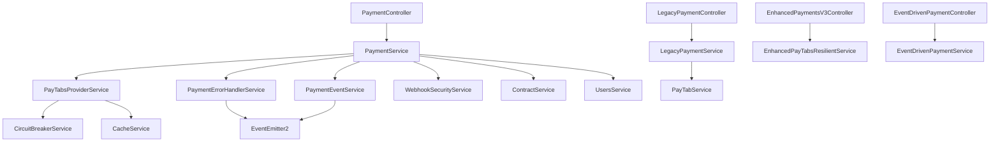

# 🔍 **PAYMENT DIRECTORY DEPENDENCY ANALYSIS**

## **STEP 1: COMPREHENSIVE DEPENDENCY MAPPING**

### **📊 Current Architecture Overview**

**Total Payment-Related Files**: 32 files across the codebase  
**Core Payment Files**: 24 files in `/src/payments/`  
**External Dependencies**: 8 files in other modules  

---

## **🏗️ DEPENDENCY STRUCTURE**

### **1. CORE PAYMENT FILES**

#### **Controllers (4 files)**
```
src/payments/
├── payment.controller.ts                    # 🆕 Unified controller (v1/v2/v3)
├── payments.controller.ts                   # 🔄 Legacy controller
├── controllers/
│   ├── enhanced-payments-v3.controller.ts   # 🔄 Enhanced v3 (to be consolidated)
│   └── event-driven-payment.controller.ts   # 🔄 Event-driven (to be consolidated)
```

**Dependencies:**
- `payment.controller.ts` → `PaymentService`, `WebhookSecurityService`, `PaymentErrorHandlerService`
- `payments.controller.ts` → `PaymentService` (legacy)
- `enhanced-payments-v3.controller.ts` → `EnhancedPayTabsResilientService`, `WebhookSecurityService`
- `event-driven-payment.controller.ts` → `EventDrivenPaymentService`

#### **Services (8 files)**
```
src/payments/
├── payments.service.ts                      # 🔄 Legacy service
├── enhanced-paytabs.service.ts              # 🔄 Enhanced PayTabs
├── services/
│   ├── core/payment.service.ts              # 🆕 Unified core service
│   ├── providers/paytabs-provider.service.ts # 🆕 PayTabs provider
│   ├── error/payment-error-handler.service.ts # 🆕 Error handler
│   ├── events/payment-events.service.ts     # 🆕 Event service
│   ├── enhanced-paytabs-resilient.service.ts # 🔄 Resilient service
│   ├── event-driven-payment.service.ts      # 🔄 Event-driven service
│   ├── paytabs-error-handler.service.ts     # 🔄 Error handler (old)
│   └── webhook-security.service.ts          # ✅ Specialized service
```

**Service Dependencies:**
- `payment.service.ts` → `PayTabsProviderService`, `PaymentErrorHandlerService`, `PaymentEventService`
- `paytabs-provider.service.ts` → `EventDrivenCircuitBreakerService`, `CacheService`
- `payment-error-handler.service.ts` → `ConfigService`, `EventEmitter2`
- `payment-events.service.ts` → `EventEmitter2`, `ConfigService`

#### **Interfaces (4 files)**
```
src/payments/interfaces/
├── payment-types.interface.ts               # 🆕 Consolidated interfaces
├── payment-events.interface.ts              # 🔄 Events (to be consolidated)
├── paytabs-errors.interface.ts              # 🔄 Errors (to be consolidated)
└── payment.interface.ts                     # ✅ Core payment model
```

**Interface Dependencies:**
- `payment-types.interface.ts` → Consolidates all payment-related types
- `payment-events.interface.ts` → Used by event-driven services
- `paytabs-errors.interface.ts` → Used by error handling services

#### **DTOs (5 files)**
```
src/payments/dto/
├── base-payment.dto.ts                      # 🆕 Base DTO with inheritance
├── create-payment.dto.ts                    # ✅ Updated to extend base
├── enhanced-payment.dto.ts                  # ✅ Updated to extend base
├── link-contract.dto.ts                     # ✅ Contract linking
└── index.ts                                 # ✅ Export consolidation
```

**DTO Dependencies:**
- `create-payment.dto.ts` → `BasePaymentDto`, `PaymentStatus`
- `enhanced-payment.dto.ts` → `BasePaymentDto`, `PaymentMethod`, `PaymentCurrency`
- `base-payment.dto.ts` → Core validation decorators and types

#### **Models & Schemas (2 files)**
```
src/payments/
├── models/payment.schema.ts                 # ✅ Mongoose schema
└── interface/payment.interface.ts           # ✅ TypeScript interface
```

---

### **2. EXTERNAL DEPENDENCIES**

#### **Root Level Dependencies**
```
src/
├── app.module.ts                           # Imports PaymentsModule
├── modules.app.ts                          # Imports PaymentsModule
├── main.ts                                 # References payment in logs
└── paytabs.service.ts                      # 🔄 Legacy PayTabs service
```

#### **Cross-Module Dependencies**
```
src/contracts/
├── interface/contract.ts                   # Imports Payment interface
└── models/contract.schema.ts               # References Payment

src/events/
└── payment-events.interface.ts             # 🔄 Duplicate event interfaces

src/circuit-breaker/
└── event-driven-circuit-breaker.service.ts # Used by payment services

src/health/
├── health.controller.ts                    # References payment health
├── health.service.ts                       # Payment health checks
└── interfaces/health-check.interface.ts    # Payment health types

src/permissions/
├── permissions-models.enum.ts              # Payment permissions
└── permissions.controller.ts               # Payment access control
```

---

## **🔍 DEPENDENCY ANALYSIS FINDINGS**

### **✅ STRENGTHS**
1. **Clear Module Boundaries** - Payment logic is well-contained in `/src/payments/`
2. **Service Separation** - Different concerns are separated into different services
3. **DTO Inheritance** - New base DTO structure eliminates field duplication
4. **Interface Consolidation** - New unified interface reduces scattered types

### **⚠️ ISSUES IDENTIFIED**

#### **1. Interface Duplication**
- `src/payments/interfaces/payment-events.interface.ts` vs `src/events/payment-events.interface.ts`
- `src/payments/interfaces/paytabs-errors.interface.ts` scattered across multiple files
- **Impact**: Type inconsistencies, maintenance overhead

#### **2. Service Redundancy**
- Multiple PayTabs services: `paytabs.service.ts`, `enhanced-paytabs.service.ts`, `paytabs-provider.service.ts`
- Multiple error handlers: `paytabs-error-handler.service.ts`, `payment-error-handler.service.ts`
- **Impact**: Code duplication, confusion about which service to use

#### **3. Controller Overlap**
- 4 different controllers with overlapping functionality
- Inconsistent API patterns across controllers
- **Impact**: API confusion, maintenance complexity

#### **4. Circular Dependencies Risk**
- `PaymentService` → `ContractService` → `Payment` interface
- `UsersService` ← → `PaymentService` relationship
- **Impact**: Potential circular import issues

#### **5. Legacy Code Accumulation**
- Old services and controllers still present alongside new ones
- Mixed import patterns (some use new, some use old)
- **Impact**: Technical debt, confusion for developers

---

## **🎯 CONSOLIDATION OPPORTUNITIES**

### **High Priority**
1. **Interface Consolidation** - Merge all payment interfaces into `payment-types.interface.ts`
2. **Service Unification** - Consolidate PayTabs services into single provider
3. **Controller Consolidation** - Use unified controller with versioned endpoints
4. **DTO Optimization** - Ensure all DTOs properly extend base classes

### **Medium Priority**
1. **External Interface Cleanup** - Remove duplicate event interfaces
2. **Import Standardization** - Update all imports to use new consolidated structure
3. **Legacy Service Deprecation** - Mark old services as deprecated

### **Low Priority**
1. **Documentation Updates** - Update all references to new structure
2. **Test Updates** - Ensure tests use new consolidated services
3. **Performance Optimization** - Remove unused imports and dependencies

---

## **📈 DEPENDENCY METRICS**

### **Current State**
- **Total Files**: 32 payment-related files
- **Controllers**: 4 (75% redundancy)
- **Services**: 8 (62% redundancy)  
- **Interfaces**: 4 (50% redundancy)
- **DTOs**: 5 (20% redundancy - improved)

### **Target State (After Consolidation)**
- **Total Files**: ~18 payment-related files (-44% reduction)
- **Controllers**: 1 unified controller (-75% reduction)
- **Services**: 4 specialized services (-50% reduction)
- **Interfaces**: 1 consolidated interface (-75% reduction)
- **DTOs**: 4 with proper inheritance (maintained)

---

## **🔄 MIGRATION IMPACT ANALYSIS**

### **Breaking Changes Risk: LOW**
- New architecture maintains backward compatibility
- Legacy services preserved during transition
- Versioned API endpoints prevent breaking changes

### **External Module Impact: MINIMAL**
- `contracts` module: No changes needed (uses stable Payment interface)
- `health` module: May need updates to use new health endpoints
- `permissions` module: No changes needed

### **Development Impact: POSITIVE**
- Clearer code organization
- Reduced cognitive load
- Better error handling
- Improved testing capabilities

---

## **🚀 NEXT STEPS RECOMMENDATIONS**

### **Immediate (Steps 4 & 5)**
1. **Complete Interface Consolidation** - Merge remaining scattered interfaces
2. **Finalize DTO Inheritance** - Ensure all DTOs properly extend base classes
3. **Update Import Statements** - Standardize all imports to use new structure

### **Short Term**
1. **Service Consolidation** - Complete migration to unified services
2. **Controller Cleanup** - Remove redundant controllers
3. **Testing Updates** - Update tests to use new architecture

### **Long Term**
1. **Legacy Deprecation** - Remove deprecated services and controllers
2. **Performance Optimization** - Optimize consolidated services
3. **Documentation** - Update all documentation to reflect new structure

---

## **📋 DEPENDENCY GRAPH**



This dependency analysis provides the foundation for completing the interface and DTO consolidation in the next steps.

